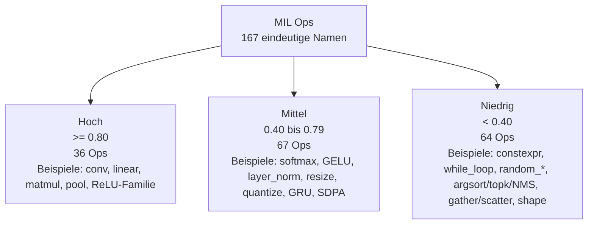

# Analyse aller MIL-Operatoren in coremltools

## Executive Summary

Die von entity["company","Apple","Cupertino, CA, US"] gehostete coremltools-API-Dokumentation strukturiert MIL-Operatoren in versionierte Gruppen von iOS 15 bis iOS 18; über die zentrale MIL-Ops-Seite, deren Sphinx-Quellseite und den Python-Module-Index lassen sich die dokumentierten Kategorien und Versionsmodule vollständig nachvollziehen. Für diese Auswertung habe ich identische Op-Namen über Versionen zusammengeführt und die Versionsdeltas im Variantenfeld notiert. citeturn3view0turn4view0turn10view0

Die API-Seiten beschreiben Semantik, Shapes, Dtypes, Parameter und Versionsunterschiede, enthalten aber keine explizite Zuordnung zu ANE, Hardware oder Compute Units. Deshalb ist jeder ANE-Score in diesem Bericht eine explizite Schätzung aus Op-Semantik, Rechen- versus Speichercharakter, Regulärität des Zugriffs und typischer ANE-Eignung im Stand 2026. citeturn22view0turn22view1turn22view2turn22view3

Das Muster ist klar: sehr gut ANE-planbar sind dichte Rechenkerne wie `conv`, `linear`, `matmul`, Pooling und einfache Aktivierungen; mittelgut planbar sind gemischte Reduktions-, Normierungs-, Resize-, Quantisierungs-, Rekurrenz- und Attention-Ops; schwach planbar sind Compile-time-, Kontrollfluss-, State-, RNG-, Sortier-, Shape-, Gather/Scatter- und Container-Ops. In den untersuchten API-Seiten fand ich außerdem keine explizite Markierung eines MIL-Op als „deprecated“ oder „undocumented“. citeturn13view0turn13view1turn13view2

## Methodik und Annahmen

Ich habe die Operatoren aus der zentralen MIL-Ops-Seite und ihrer Quellseite enumeriert, die Versionstabellen mit dem Python-Module-Index gegengeprüft und anschließend versionsgleiche Namen entdoppelt. Das ergibt in dieser Fassung **167 eindeutige dokumentierte MIL-Op-Namen**; iOS15/16/17/18-Varianten werden im Tabellenfeld **„Varianten / relevante Attribute“** zusammengezogen. citeturn3view0turn4view0turn10view0

Die Kurzbeschreibungen in den Tabellen sind komprimierte deutschsprachige Verdichtungen der jeweiligen Apple-Doktexte; der Op-Name selbst verlinkt auf die konkrete Doc-Stelle. Wo Apple für neuere Versionen nur Deltas dokumentiert, referenziert die Tabelle den Basiskern der älteren Version und notiert das Delta knapp. Die ANE-Scores sind **keine Apple-Aussage**, sondern eine heuristische Schätzung. Hohe Scores erhalten dichte, reguläre Tensorops; niedrige Scores erhalten irreguläre Speicherzugriffe, dynamische Ausgaben, Kontrollfluss, Zustandsoperationen, Compile-time-Dekompression oder reine Shape-/Containerlogik. citeturn3view0turn8search0turn18view5turn19view0turn19view1turn20view3turn20view4turn21view3turn22view0turn22view1turn22view2turn22view3

## Hohe ANE-Planbarkeit

Die folgende Matrix bündelt Ops mit geschätzter ANE-Planbarkeit von **0.80 bis 1.00**. Gemeinsames Muster: dichte, reguläre Tensorarithmetik; lokale Fenster; lineare Algebra; oder sehr einfache elementweise Nichtlinearitäten. Apple dokumentiert diese Familien als klassische numerische Tensorops mit klaren Shapes, Parametern und relativ kleinen Versionsdeltas. citeturn20view0turn18view5turn6view2turn20view3turn20view4turn24view0turn24view1turn24view3turn20view2turn18view4turn16view10

| Familie | Op | Offizielle Kurzbeschreibung | Kurzfunktion | ANE | Varianten / relevante Attribute |
|---|---|---|---|---|---|
| Activation | [`relu`](https://apple.github.io/coremltools/source/coremltools.converters.mil.mil.ops.defs.html#coremltools.converters.mil.mil.ops.defs.iOS15.activation.relu) | ReLU: negative Werte werden auf `0` gesetzt. | Standardaktivierung für dichte Netze. | 0.98 — Archetypischer ANE-Kernel; häufig zusätzlich fusionierbar. | — |
| Activation | [`relu6`](https://apple.github.io/coremltools/source/coremltools.converters.mil.mil.ops.defs.html#coremltools.converters.mil.mil.ops.defs.iOS15.activation.relu6) | ReLU6: wie ReLU, aber auf `6` gekappt. | Mobilfreundliche Sättigungsaktivierung. | 0.97 — Elementweise Clamp-Variante; sehr ANE-freundlich. | — |
| Activation | [`sigmoid_hard`](https://apple.github.io/coremltools/source/coremltools.converters.mil.mil.ops.defs.html#coremltools.converters.mil.mil.ops.defs.iOS15.activation.sigmoid_hard) | Hartes Sigmoid `min(max(alpha*x+beta,0),1)`. | Piecewise-lineare Sigmoid-Approximation. | 0.97 — Nur affine Transformation plus Clamp; ideal für feste Datenpfade. | iOS17+: `alpha`/`beta` dürfen anderen dtype haben. |
| Activation | [`thresholded_relu`](https://apple.github.io/coremltools/source/coremltools.converters.mil.mil.ops.defs.html#coremltools.converters.mil.mil.ops.defs.iOS15.activation.thresholded_relu) | Gibt `x` nur oberhalb einer Schwelle `alpha` durch. | Sparsifizierende Schwellenaktivierung. | 0.96 — Vergleich plus Auswahl ist ein sehr guter Elementwise-Fall. | iOS17+: `alpha` darf anderen dtype haben. |
| Activation | [`clamped_relu`](https://apple.github.io/coremltools/source/coremltools.converters.mil.mil.ops.defs.html#coremltools.converters.mil.mil.ops.defs.iOS15.activation.clamped_relu) | Gekappte ReLU mit Steigung `alpha` im negativen Bereich und Obergrenze `beta`. | Punktweise Aktivierung mit linearem Negativzweig und Sättigung. | 0.95 — Reine punktweise Arithmetik mit konstanten Parametern. | iOS17+: `alpha`/`beta` dürfen anderen dtype haben. |
| Activation | [`leaky_relu`](https://apple.github.io/coremltools/source/coremltools.converters.mil.mil.ops.defs.html#coremltools.converters.mil.mil.ops.defs.iOS15.activation.leaky_relu) | Leaky ReLU mit konstanter negativer Steigung `alpha`. | Punktweise Aktivierung ohne harte Sättigung. | 0.95 — Sehr einfacher dataparalleler Kernel. | iOS17+: `alpha` darf anderen dtype haben. |
| Activation | [`linear_activation`](https://apple.github.io/coremltools/source/coremltools.converters.mil.mil.ops.defs.html#coremltools.converters.mil.mil.ops.defs.iOS15.activation.linear_activation) | Lineare Aktivierung `alpha*x + beta`. | Skalierung plus Bias als Elementwise-Fusion. | 0.95 — Affine Elementwise-Operationen sind ANE-nah. | iOS17+: `alpha`/`beta` dürfen anderen dtype haben. |
| Activation | [`prelu`](https://apple.github.io/coremltools/source/coremltools.converters.mil.mil.ops.defs.html#coremltools.converters.mil.mil.ops.defs.iOS15.activation.prelu) | Kanalweises Parametric ReLU mit `alpha_i` pro Kanal. | Punktweise Aktivierung mit kanalabhängiger Negativsteigung. | 0.90 — Weiterhin elementweise; Broadcast-Aufwand bleibt klein. | iOS17+: `alpha` darf anderen dtype haben. |
| Activation | [`sigmoid`](https://apple.github.io/coremltools/source/coremltools.converters.mil.mil.ops.defs.html#coremltools.converters.mil.mil.ops.defs.iOS15.activation.sigmoid) | Elementweises `sigmoid(x)`. | Gate-/Wahrscheinlichkeitsaktivierung. | 0.85 — Reguläre, sehr häufige Punktoperation. | — |
| Activation | [`softsign`](https://apple.github.io/coremltools/source/coremltools.converters.mil.mil.ops.defs.html#coremltools.converters.mil.mil.ops.defs.iOS15.activation.softsign) | Elementweises `x / (1 + abs(x))`. | Glättende, saturierende Aktivierung ohne Exp/Log. | 0.84 — Reguläre Elementwise-Arithmetik bleibt ANE-freundlich. | — |
| Activation | [`silu`](https://apple.github.io/coremltools/source/coremltools.converters.mil.mil.ops.defs.html#coremltools.converters.mil.mil.ops.defs.iOS15.activation.silu) | SiLU/Swish: `x * sigmoid(x)`. | Selbst-gatende Aktivierung. | 0.82 — Wenige elementweise Bausteine, häufig fusionierbar. | — |
| Activation | [`scaled_tanh`](https://apple.github.io/coremltools/source/coremltools.converters.mil.mil.ops.defs.html#coremltools.converters.mil.mil.ops.defs.iOS15.activation.scaled_tanh) | Skaliertes `tanh(alpha*x)` mit zusätzlichem Faktor `beta`. | Glättende Aktivierung mit Vor- und Nachskalierung. | 0.80 — Elementweise mit transzendenter Funktion; noch gut planbar. | iOS17+: `alpha`/`beta` dürfen anderen dtype haben. |
| Convolution | [`conv`](https://apple.github.io/coremltools/source/coremltools.converters.mil.mil.ops.defs.html#coremltools.converters.mil.mil.ops.defs.iOS15.conv.conv) | Führt 1D-, 2D- oder 3D-Convolution über den Input aus. | Kernoperator für CNNs und viele Hybridblöcke. | 0.99 — Dichte, lokale MAC-Arbeit ist der prototypische ANE-Fall. | Gruppen, Dilatation, Strides und 3D beeinflussen Effizienz; iOS17+: Gewicht/Bias anderer dtype. |
| Convolution | [`conv_transpose`](https://apple.github.io/coremltools/source/coremltools.converters.mil.mil.ops.defs.html#coremltools.converters.mil.mil.ops.defs.iOS15.conv.conv_transpose) | Transponierte 1D-/2D-/3D-Convolution über den Input. | Upsampling-/Decoder-Operator mit gewichteter Streuung. | 0.86 — Weiterhin MAC-lastig und regelmäßig. | iOS17+: Gewicht/Bias anderer dtype; Gewicht muss nicht const sein. |
| Elementwise binary | [`mul`](https://apple.github.io/coremltools/source/coremltools.converters.mil.mil.ops.defs.html#coremltools.converters.mil.mil.ops.defs.iOS15.elementwise_binary.mul) | Elementweises `x * y` mit Broadcasting. | Punktweise Multiplikation. | 0.97 — Kernbaustein vieler Fusionspfade. | — |
| Elementwise binary | [`add`](https://apple.github.io/coremltools/source/coremltools.converters.mil.mil.ops.defs.html#coremltools.converters.mil.mil.ops.defs.iOS15.elementwise_binary.add) | Elementweises `x + y` mit Broadcasting. | Punktweise Addition. | 0.96 — Sehr einfacher dataparalleler Tensorop. | — |
| Elementwise binary | [`sub`](https://apple.github.io/coremltools/source/coremltools.converters.mil.mil.ops.defs.html#coremltools.converters.mil.mil.ops.defs.iOS15.elementwise_binary.sub) | Elementweises `x - y` mit Broadcasting. | Punktweise Subtraktion. | 0.96 — Einfache, voll parallele Arithmetik. | — |
| Elementwise binary | [`maximum`](https://apple.github.io/coremltools/source/coremltools.converters.mil.mil.ops.defs.html#coremltools.converters.mil.mil.ops.defs.iOS15.elementwise_binary.maximum) | Elementweises Maximum mit Broadcasting. | Punktweise Auswahl des größeren Werts. | 0.93 — Einfacher Selektionstyp, gut fusionierbar. | — |
| Elementwise binary | [`minimum`](https://apple.github.io/coremltools/source/coremltools.converters.mil.mil.ops.defs.html#coremltools.converters.mil.mil.ops.defs.iOS15.elementwise_binary.minimum) | Elementweises Minimum mit Broadcasting. | Punktweise Auswahl des kleineren Werts. | 0.93 — Identisch günstig wie `maximum`. | — |
| Elementwise unary | [`clip`](https://apple.github.io/coremltools/source/coremltools.converters.mil.mil.ops.defs.html#coremltools.converters.mil.mil.ops.defs.iOS15.elementwise_unary.clip) | Begrenzt `x` elementweise auf ein Intervall. | Clamp-/Sättigungsoperator. | 0.96 — Idealer Elementwise-Fusionskandidat. | iOS17+: zusätzliche Integer-Dtypes. |
| Elementwise unary | [`abs`](https://apple.github.io/coremltools/source/coremltools.converters.mil.mil.ops.defs.html#coremltools.converters.mil.mil.ops.defs.iOS15.elementwise_unary.abs) | Elementweiser Betrag `abs(x)`. | Betragbildung. | 0.95 — Sehr einfacher Punktkernel. | — |
| Elementwise unary | [`square`](https://apple.github.io/coremltools/source/coremltools.converters.mil.mil.ops.defs.html#coremltools.converters.mil.mil.ops.defs.iOS15.elementwise_unary.square) | Elementweises `x^2`. | Punktweise Quadrierung. | 0.94 — Einfacher Punktkernel mit hohem Fusionspotenzial. | — |
| Elementwise unary | [`threshold`](https://apple.github.io/coremltools/source/coremltools.converters.mil.mil.ops.defs.html#coremltools.converters.mil.mil.ops.defs.iOS15.elementwise_unary.threshold) | Schwellt `x` elementweise gegen einen konstanten Wert. | Punktweise Schwellenfunktion. | 0.92 — Vergleich plus Auswahl passt sehr gut auf ANE. | — |
| Elementwise unary | [`tanh`](https://apple.github.io/coremltools/source/coremltools.converters.mil.mil.ops.defs.html#coremltools.converters.mil.mil.ops.defs.iOS15.elementwise_unary.tanh) | Elementweiser hyperbolischer Tangens. | Klassische saturierende Aktivierung. | 0.82 — Etablierter Punktkernel in Sequenzmodellen. | — |
| Elementwise unary | [`rsqrt`](https://apple.github.io/coremltools/source/coremltools.converters.mil.mil.ops.defs.html#coremltools.converters.mil.mil.ops.defs.iOS15.elementwise_unary.rsqrt) | Elementweiser reziproker Quadratwurzel mit `epsilon`. | Wichtig in Normierungspfaden. | 0.80 — Häufig in Norm- und Attention-Pipelines. | iOS17+: zusätzliche Integer-Dtypes. |
| Image resizing | [`upsample_nearest_neighbor`](https://apple.github.io/coremltools/source/coremltools.converters.mil.mil.ops.defs.html#coremltools.converters.mil.mil.ops.defs.iOS15.image_resizing.upsample_nearest_neighbor) | Nearest-neighbor-Upsampling des Inputs. | Spezialisierter diskreter Upscaler. | 0.92 — Sehr einfacher, deterministischer Layout-/Abtastpfad. | Skalierungsfaktoren bestimmen Effizienz. |
| Image resizing | [`resize_nearest_neighbor`](https://apple.github.io/coremltools/source/coremltools.converters.mil.mil.ops.defs.html#coremltools.converters.mil.mil.ops.defs.iOS15.image_resizing.resize_nearest_neighbor) | Nearest-neighbor-Resize entlang räumlicher Achsen. | Einfaches diskretes Upscaling/Downscaling. | 0.90 — Sehr reguläre Adressierung ohne bilineare Mischungen. | Skalierungsfaktoren und Achswahl wichtig. |
| Image resizing | [`upsample_bilinear`](https://apple.github.io/coremltools/source/coremltools.converters.mil.mil.ops.defs.html#coremltools.converters.mil.mil.ops.defs.iOS15.image_resizing.upsample_bilinear) | Bilineares Upsampling des Inputs. | Spezialisierter Bilinear-Upscaler. | 0.86 — Statisches Upsampling ist gut planbar. | iOS16+: `half_pixel_centers`. |
| Image resizing | [`resize_bilinear`](https://apple.github.io/coremltools/source/coremltools.converters.mil.mil.ops.defs.html#coremltools.converters.mil.mil.ops.defs.iOS15.image_resizing.resize_bilinear) | Bilineares Resize entlang räumlicher Achsen. | Reguläres denses Bild-Resize. | 0.82 — Regelmäßige Rasterinterpolation ist hardwaretauglich. | `align_corners`/Samplingkonvention relevant. |
| Linear | [`linear`](https://apple.github.io/coremltools/source/coremltools.converters.mil.mil.ops.defs.html#coremltools.converters.mil.mil.ops.defs.iOS15.linear.linear) | Berechnet `x * weight.T + bias`. | Vollverbundene affine Projektion. | 0.98 — Dichte Matrixarbeit passt hervorragend auf ANE. | iOS17+: Gewicht/Bias anderer dtype. |
| Linear | [`matmul`](https://apple.github.io/coremltools/source/coremltools.converters.mil.mil.ops.defs.html#coremltools.converters.mil.mil.ops.defs.iOS15.linear.matmul) | N-dimensionale Batch-Matrixmultiplikation mit Broadcasting. | Generischer dichte Kontraktionskern. | 0.97 — Batch-Matmul ist eine der klarsten ANE-Zielstrukturen. | `transpose_x`/`transpose_y` und Broadcasting wichtig; iOS17+: gemischte dtypes wenn eine Seite const. |
| Normalization | [`batch_norm`](https://apple.github.io/coremltools/source/coremltools.converters.mil.mil.ops.defs.html#coremltools.converters.mil.mil.ops.defs.iOS15.normalization.batch_norm) | Normalisiert `x` mit `mean`, `variance`, optional `gamma` und `beta`. | Kanalweise Normalisierung mit affiner Nachskalierung. | 0.90 — Sehr häufig und oft fusionierbar. | iOS17+: andere Dtypes für Statistik-/Skalenparameter erlaubt. |
| Pooling | [`max_pool`](https://apple.github.io/coremltools/source/coremltools.converters.mil.mil.ops.defs.html#coremltools.converters.mil.mil.ops.defs.iOS15.pool.max_pool) | Max Pooling über 1D-, 2D- oder 3D-Raumdimensionen. | Fensterbasierte Maximalwertreduktion. | 0.93 — Regelmäßige lokale Reduktion passt sehr gut zum ANE. | Kernelgröße, Stride, Padding und 3D relevant. |
| Pooling | [`avg_pool`](https://apple.github.io/coremltools/source/coremltools.converters.mil.mil.ops.defs.html#coremltools.converters.mil.mil.ops.defs.iOS15.pool.avg_pool) | Average Pooling über 1D-, 2D- oder 3D-Raumdimensionen. | Fensterbasierte Mittelwertverdichtung. | 0.92 — Regelmäßige Fensterreduktion ist gut abbildbar. | Kernelgröße, Stride, Padding und 3D relevant. |
| Reduction | [`reduce_sum`](https://apple.github.io/coremltools/source/coremltools.converters.mil.mil.ops.defs.html#coremltools.converters.mil.mil.ops.defs.iOS15.reduction.reduce_sum) | Reduziert auf die Summe über Achsen. | Klassische Summenreduktion. | 0.82 — Standardreduktion mit guter ANE-Eignung. | Achsenwahl und `keep_dims` relevant. |
| Reduction | [`reduce_max`](https://apple.github.io/coremltools/source/coremltools.converters.mil.mil.ops.defs.html#coremltools.converters.mil.mil.ops.defs.iOS15.reduction.reduce_max) | Reduziert auf das Maximum über Achsen. | Wertreduktion über Tensorachsen. | 0.80 — Reguläre Maxreduktion ist gut hardwaretauglich. | Achsenwahl und `keep_dims` relevant. |

## Mittlere ANE-Planbarkeit

Diese Ops liegen geschätzt bei **0.40 bis 0.79**. Typisch sind transzendente Punktfunktionen, komplexere Reduktionen, Normierungen mit flexiblen Achsen, generischere Resize-/Transformationspfade, explizite Quantisierung sowie rekurrente oder Attention-artige Blöcke: noch oft ANE-fähig, aber weniger direkt und seltener als „ideal geformter“ Hauptkernel. citeturn20view1turn20view3turn18view4turn17view2turn17view3turn17view7turn16view10turn21view2turn18view3turn19view2turn24view0turn24view1turn24view3

| Familie | Op | Offizielle Kurzbeschreibung | Kurzfunktion | ANE | Varianten / relevante Attribute |
|---|---|---|---|---|---|
| Activation | [`softmax`](https://apple.github.io/coremltools/source/coremltools.converters.mil.mil.ops.defs.html#coremltools.converters.mil.mil.ops.defs.iOS15.activation.softmax) | Normalisiert mit `exp(x)/sum(exp(x))` entlang einer Achse. | Wandelt Logits in normierte Gewichte/Wahrscheinlichkeiten um. | 0.78 — Exponentialfunktion plus Reduktion; planbar, aber nicht trivial. | Achse relevant; große Sequenzachsen erhöhen Reduktionsdruck. |
| Activation | [`elu`](https://apple.github.io/coremltools/source/coremltools.converters.mil.mil.ops.defs.html#coremltools.converters.mil.mil.ops.defs.iOS15.activation.elu) | ELU: positive Werte bleiben, negative werden als `alpha*(e^x-1)` transformiert. | Nichtlineare, punktweise Aktivierung mit Exponentialterm. | 0.75 — Elementweise, aber teurer als ReLU. | iOS17+: `alpha` darf anderen dtype haben. |
| Activation | [`softplus_parametric`](https://apple.github.io/coremltools/source/coremltools.converters.mil.mil.ops.defs.html#coremltools.converters.mil.mil.ops.defs.iOS15.activation.softplus_parametric) | Kanalweises `alpha_i * log(1 + e^(beta_i*x_i))`. | Softplus mit per-Kanal-Skalierung. | 0.72 — Regulär, aber Exp/Log plus Broadcast drücken die Effizienz. | iOS17+: `alpha`/`beta` dürfen anderen dtype haben. |
| Activation | [`gelu`](https://apple.github.io/coremltools/source/coremltools.converters.mil.mil.ops.defs.html#coremltools.converters.mil.mil.ops.defs.iOS15.activation.gelu) | Gaussian Error Linear Unit in exakter oder approximierter Form. | Gängige Transformer-Aktivierung. | 0.70 — Häufig fusionierbar, aber komplexer als piecewise-lineare Aktivierungen. | Modi `EXACT`, `TANH_APPROXIMATION`, `SIGMOID_APPROXIMATION`. |
| Activation | [`softplus`](https://apple.github.io/coremltools/source/coremltools.converters.mil.mil.ops.defs.html#coremltools.converters.mil.mil.ops.defs.iOS15.activation.softplus) | Elementweises `log(1+e^x)`. | Glatte ReLU-ähnliche Aktivierung. | 0.68 — Elementwise-Kette mit Exp/Log-Kosten. | — |
| Control flow | [`select`](https://apple.github.io/coremltools/source/coremltools.converters.mil.mil.ops.defs.html#coremltools.converters.mil.mil.ops.defs.iOS15.control_flow.select) | Wählt elementweise aus `a` oder `b` abhängig von `cond`. | Broadcastbare Mux-/Where-Operation. | 0.72 — Elementweises Predication-Muster ist gut planbar. | Wenn `a`/`b` fehlen, entsteht Indexausgabe. |
| Elementwise binary | [`equal`](https://apple.github.io/coremltools/source/coremltools.converters.mil.mil.ops.defs.html#coremltools.converters.mil.mil.ops.defs.iOS15.elementwise_binary.equal) | Elementweises `x == y` mit Broadcasting. | Vergleichsoperator für Masking. | 0.68 — Reguläre Punktoperation, aber kein Hauptdurchsatztreiber. | — |
| Elementwise binary | [`greater`](https://apple.github.io/coremltools/source/coremltools.converters.mil.mil.ops.defs.html#coremltools.converters.mil.mil.ops.defs.iOS15.elementwise_binary.greater) | Elementweises `x > y` mit Broadcasting. | Maskenerzeugung durch Vergleich. | 0.68 — Planbar, aber eher Hilfslogik. | — |
| Elementwise binary | [`greater_equal`](https://apple.github.io/coremltools/source/coremltools.converters.mil.mil.ops.defs.html#coremltools.converters.mil.mil.ops.defs.iOS15.elementwise_binary.greater_equal) | Elementweises `x >= y` mit Broadcasting. | Maskenerzeugung durch Vergleich. | 0.68 — Einfach, aber selten dominanter ANE-Kernel. | — |
| Elementwise binary | [`less`](https://apple.github.io/coremltools/source/coremltools.converters.mil.mil.ops.defs.html#coremltools.converters.mil.mil.ops.defs.iOS15.elementwise_binary.less) | Elementweises `x < y` mit Broadcasting. | Maskenerzeugung durch Vergleich. | 0.68 — Dataparallel, aber überwiegend Hilfsop. | — |
| Elementwise binary | [`less_equal`](https://apple.github.io/coremltools/source/coremltools.converters.mil.mil.ops.defs.html#coremltools.converters.mil.mil.ops.defs.iOS15.elementwise_binary.less_equal) | Elementweises `x <= y` mit Broadcasting. | Maskenerzeugung durch Vergleich. | 0.68 — Wie andere Vergleiche eher Nebenlogik. | — |
| Elementwise binary | [`not_equal`](https://apple.github.io/coremltools/source/coremltools.converters.mil.mil.ops.defs.html#coremltools.converters.mil.mil.ops.defs.iOS15.elementwise_binary.not_equal) | Elementweises `x != y` mit Broadcasting. | Maskenerzeugung durch Ungleichheitstest. | 0.68 — Einfach, aber nicht throughput-bestimmend. | — |
| Elementwise binary | [`logical_and`](https://apple.github.io/coremltools/source/coremltools.converters.mil.mil.ops.defs.html#coremltools.converters.mil.mil.ops.defs.iOS15.elementwise_binary.logical_and) | Elementweises logisches UND mit Broadcasting. | Boolesche Maskenkombination. | 0.60 — Machbar, aber weniger typisch für ANE-Hauptpfade. | — |
| Elementwise binary | [`logical_or`](https://apple.github.io/coremltools/source/coremltools.converters.mil.mil.ops.defs.html#coremltools.converters.mil.mil.ops.defs.iOS15.elementwise_binary.logical_or) | Elementweises logisches ODER mit Broadcasting. | Boolesche Maskenkombination. | 0.60 — Boolesche Hilfslogik statt Primärkern. | — |
| Elementwise binary | [`real_div`](https://apple.github.io/coremltools/source/coremltools.converters.mil.mil.ops.defs.html#coremltools.converters.mil.mil.ops.defs.iOS15.elementwise_binary.real_div) | Elementweises `x / y` mit Broadcasting. | Gleitkommadivision. | 0.55 — Dataparallel, aber weniger attraktiv als Add/Mul. | — |
| Elementwise binary | [`logical_xor`](https://apple.github.io/coremltools/source/coremltools.converters.mil.mil.ops.defs.html#coremltools.converters.mil.mil.ops.defs.iOS15.elementwise_binary.logical_xor) | Elementweises logisches XOR mit Broadcasting. | Boolesche Maskenkombination. | 0.58 — Regulär, aber eher randständig. | — |
| Elementwise binary | [`floor_div`](https://apple.github.io/coremltools/source/coremltools.converters.mil.mil.ops.defs.html#coremltools.converters.mil.mil.ops.defs.iOS15.elementwise_binary.floor_div) | Elementweises `floor(x / y)` mit Broadcasting. | Ganzzahlige/abgerundete Division. | 0.42 — Division plus Abrundung ist deutlich unattraktiver als Add/Mul. | — |
| Elementwise unary | [`sqrt`](https://apple.github.io/coremltools/source/coremltools.converters.mil.mil.ops.defs.html#coremltools.converters.mil.mil.ops.defs.iOS15.elementwise_unary.sqrt) | Elementweise Quadratwurzel. | Wurzeloperator. | 0.78 — Häufig in Norm-/Distanzpfaden. | — |
| Elementwise unary | [`inverse`](https://apple.github.io/coremltools/source/coremltools.converters.mil.mil.ops.defs.html#coremltools.converters.mil.mil.ops.defs.iOS15.elementwise_unary.inverse) | Elementweiser Kehrwert mit `epsilon`. | Invertiert Werte als Punktoperation. | 0.72 — Gut dataparallel, aber teurer als primitive Arithmetik. | iOS17+: zusätzliche Integer-Dtypes. |
| Elementwise unary | [`ceil`](https://apple.github.io/coremltools/source/coremltools.converters.mil.mil.ops.defs.html#coremltools.converters.mil.mil.ops.defs.iOS15.elementwise_unary.ceil) | Elementweises Aufrunden. | Rundungsoperator. | 0.70 — Punktweise und simpel. | — |
| Elementwise unary | [`floor`](https://apple.github.io/coremltools/source/coremltools.converters.mil.mil.ops.defs.html#coremltools.converters.mil.mil.ops.defs.iOS15.elementwise_unary.floor) | Elementweises Abrunden gegen `-∞`. | Rundungsoperator. | 0.70 — Regulärer Punktkernel. | — |
| Elementwise unary | [`exp`](https://apple.github.io/coremltools/source/coremltools.converters.mil.mil.ops.defs.html#coremltools.converters.mil.mil.ops.defs.iOS15.elementwise_unary.exp) | Elementweises `e^x`. | Exponentialfunktion. | 0.68 — Häufig genug, aber teurer als lineare/clamp-basierte Ops. | — |
| Elementwise unary | [`round`](https://apple.github.io/coremltools/source/coremltools.converters.mil.mil.ops.defs.html#coremltools.converters.mil.mil.ops.defs.iOS15.elementwise_unary.round) | Elementweises Runden zur nächsten Ganzzahl. | Rundungsoperator. | 0.68 — Punktweise und einfach. | — |
| Elementwise unary | [`log`](https://apple.github.io/coremltools/source/coremltools.converters.mil.mil.ops.defs.html#coremltools.converters.mil.mil.ops.defs.iOS15.elementwise_unary.log) | Elementweiser natürlicher Logarithmus mit `epsilon`. | Log-Transformation. | 0.65 — Elementweise, aber transzendent. | iOS17+: zusätzliche Integer-Dtypes. |
| Elementwise unary | [`sign`](https://apple.github.io/coremltools/source/coremltools.converters.mil.mil.ops.defs.html#coremltools.converters.mil.mil.ops.defs.iOS15.elementwise_unary.sign) | Elementweises Vorzeichen. | Reduziert Werte auf Vorzeicheninformation. | 0.65 — Simpel, aber semantisch meist Hilfslogik. | — |
| Elementwise unary | [`exp2`](https://apple.github.io/coremltools/source/coremltools.converters.mil.mil.ops.defs.html#coremltools.converters.mil.mil.ops.defs.iOS15.elementwise_unary.exp2) | Elementweises `2^x`. | Basis-2-Exponentialfunktion. | 0.62 — Ähnlich wie `exp`, aber weniger Standard. | — |
| Elementwise unary | [`cast`](https://apple.github.io/coremltools/source/coremltools.converters.mil.mil.ops.defs.html#coremltools.converters.mil.mil.ops.defs.iOS15.elementwise_unary.cast) | Castet `x` in den Zieltyp `dtype`. | Typkonvertierung. | 0.55 — Häufig Vor-/Nachbereitung oder Fusion. | iOS17+: zusätzliche Integer-Dtypes. |
| Elementwise unary | [`logical_not`](https://apple.github.io/coremltools/source/coremltools.converters.mil.mil.ops.defs.html#coremltools.converters.mil.mil.ops.defs.iOS15.elementwise_unary.logical_not) | Elementweises logisches NICHT. | Maskeninvertierung. | 0.60 — Boolesche Punktlogik ist machbar, aber selten Hauptpfad. | — |
| Elementwise unary | [`cos`](https://apple.github.io/coremltools/source/coremltools.converters.mil.mil.ops.defs.html#coremltools.converters.mil.mil.ops.defs.iOS15.elementwise_unary.cos) | Elementweiser Kosinus. | Trigonometrische Funktion. | 0.45 — Transzendente Spezialfunktion mit nur mäßiger direkter ANE-Eignung. | — |
| Elementwise unary | [`sin`](https://apple.github.io/coremltools/source/coremltools.converters.mil.mil.ops.defs.html#coremltools.converters.mil.mil.ops.defs.iOS15.elementwise_unary.sin) | Elementweiser Sinus. | Trigonometrische Funktion. | 0.45 — Spezialfunktion mit mäßiger direkter Eignung. | — |
| Elementwise unary | [`atan`](https://apple.github.io/coremltools/source/coremltools.converters.mil.mil.ops.defs.html#coremltools.converters.mil.mil.ops.defs.iOS15.elementwise_unary.atan) | Elementweiser Arkustangens. | Inverse trigonometrische Funktion. | 0.45 — Rein elementweise, aber transzendent. | — |
| Elementwise unary | [`erf`](https://apple.github.io/coremltools/source/coremltools.converters.mil.mil.ops.defs.html#coremltools.converters.mil.mil.ops.defs.iOS15.elementwise_unary.erf) | Elementweise Fehlerfunktion. | Spezialfunktion, u. a. für exaktes GELU relevant. | 0.45 — Planbar, aber kein besonders günstiger Standardkernel. | — |
| Elementwise unary | [`acos`](https://apple.github.io/coremltools/source/coremltools.converters.mil.mil.ops.defs.html#coremltools.converters.mil.mil.ops.defs.iOS15.elementwise_unary.acos) | Elementweiser Arkuskosinus. | Inverse trigonometrische Funktion. | 0.42 — Schwerer als primitive Punktarithmetik. | — |
| Elementwise unary | [`asin`](https://apple.github.io/coremltools/source/coremltools.converters.mil.mil.ops.defs.html#coremltools.converters.mil.mil.ops.defs.iOS15.elementwise_unary.asin) | Elementweiser Arkussinus. | Inverse trigonometrische Funktion. | 0.42 — Wie `acos` numerisch aufwendiger. | — |
| Elementwise unary | [`cosh`](https://apple.github.io/coremltools/source/coremltools.converters.mil.mil.ops.defs.html#coremltools.converters.mil.mil.ops.defs.iOS15.elementwise_unary.cosh) | Elementweiser hyperbolischer Kosinus. | Hyperbolische Spezialfunktion. | 0.40 — Komplexer als primitive Punktarithmetik. | — |
| Elementwise unary | [`sinh`](https://apple.github.io/coremltools/source/coremltools.converters.mil.mil.ops.defs.html#coremltools.converters.mil.mil.ops.defs.iOS15.elementwise_unary.sinh) | Elementweiser hyperbolischer Sinus. | Hyperbolische Spezialfunktion. | 0.40 — Weniger typisch und numerisch schwerer. | — |
| Image resizing | [`resize`](https://apple.github.io/coremltools/source/coremltools.converters.mil.mil.ops.defs.html#coremltools.converters.mil.mil.ops.defs.iOS17.image_resizing.resize) | Resized den Input über die rechten `resized_dims`-Dimensionen. | Generischer Resize-Op. | 0.78 — Regulärer als freies Resample, aber generischer als Spezialvarianten. | `resized_dims`, Modus und Zielshape sind entscheidend. |
| Image resizing | [`crop_resize`](https://apple.github.io/coremltools/source/coremltools.converters.mil.mil.ops.defs.html#coremltools.converters.mil.mil.ops.defs.iOS15.image_resizing.crop_resize) | Schneidet Boxen aus und skaliert sie auf Zielgröße. | ROI-Extraktion plus Resize. | 0.62 — Regularer als freies Resampling, aber weiterhin koordinatengeprägt. | iOS16/17 erweitern Typen und Parameter; Box-Format, Samplingmodus, `pad_value` wichtig. |
| Image resizing | [`affine`](https://apple.github.io/coremltools/source/coremltools.converters.mil.mil.ops.defs.html#coremltools.converters.mil.mil.ops.defs.iOS15.image_resizing.affine) | Wendet eine affine Transformation auf ein Bild/Tensorfeld an. | Geometrische Transformation mit Abtastung. | 0.48 — Koordinatentransformation plus Interpolation ist nur mittel ANE-freundlich. | Samplingmodus/Koordinatenmodell entscheidend. |
| Image resizing | [`resample`](https://apple.github.io/coremltools/source/coremltools.converters.mil.mil.ops.defs.html#coremltools.converters.mil.mil.ops.defs.iOS15.image_resizing.resample) | Resampelt `x` an gegebenen `coordinates`; `sampling_mode` bestimmt die Interpolation. | Allgemeines geometri­sches Abtasten. | 0.45 — Freie Koordinaten erzeugen unregelmäßige Leserichtungen. | iOS16/17 erweitern Koordinaten-Dtypes; `sampling_mode` stark relevant. |
| Linear | [`einsum`](https://apple.github.io/coremltools/source/coremltools.converters.mil.mil.ops.defs.html#coremltools.converters.mil.mil.ops.defs.iOS15.linear.einsum) | Einsum-Kontraktion; dokumentiert sind nur wenige Gleichungsformen. | Verdichtete Tensor-Kontraktion, oft matmul-ähnlich. | 0.76 — Gut, wenn auf reguläre Kontraktionen fällt. | Nur bestimmte Gleichungen erlaubt. |
| Normalization | [`instance_norm`](https://apple.github.io/coremltools/source/coremltools.converters.mil.mil.ops.defs.html#coremltools.converters.mil.mil.ops.defs.iOS15.normalization.instance_norm) | Wendet Instanznormalisierung auf den Input an. | Pro-Instanz/Pro-Kanal-Normierung. | 0.78 — Reduktion plus affine Schritte sind gut planbar. | iOS17+: gemischte Dtypes erlaubt. |
| Normalization | [`l2_norm`](https://apple.github.io/coremltools/source/coremltools.converters.mil.mil.ops.defs.html#coremltools.converters.mil.mil.ops.defs.iOS15.normalization.l2_norm) | Normalisiert entlang Achsen auf die L2-Norm. | Normierungsop mit Sum-of-squares und Wurzel. | 0.74 — Gut planbar, aber komplexer als Sum/Max/Mean. | iOS17+: gemischte Dtypes erlaubt. |
| Normalization | [`layer_norm`](https://apple.github.io/coremltools/source/coremltools.converters.mil.mil.ops.defs.html#coremltools.converters.mil.mil.ops.defs.iOS15.normalization.layer_norm) | Wendet LayerNorm auf den Input an. | Normiert über Featureachsen. | 0.72 — Häufig, aber Achsenreduktion erschwert Spitzenplanung etwas. | iOS17+: gemischte Dtypes erlaubt. |
| Normalization | [`local_response_norm`](https://apple.github.io/coremltools/source/coremltools.converters.mil.mil.ops.defs.html#coremltools.converters.mil.mil.ops.defs.iOS15.normalization.local_response_norm) | Wendet lokale Response-Normalisierung über benachbarte Kanäle an. | Ältere fensterbasierte Kanalnormalisierung. | 0.48 — Weniger attraktiv als Batch-/LayerNorm. | iOS17+: gemischte Dtypes erlaubt. |
| Pooling | [`l2_pool`](https://apple.github.io/coremltools/source/coremltools.converters.mil.mil.ops.defs.html#coremltools.converters.mil.mil.ops.defs.iOS15.pool.l2_pool) | L2-Pooling über Raumfenster. | Fensterreduktion mit Quadratsumme und Wurzel. | 0.75 — Regelmäßig, aber teurer als max/avg. | Kernelgröße und 3D beeinflussen Kosten. |
| Quantization | [`quantize`](https://apple.github.io/coremltools/source/coremltools.converters.mil.mil.ops.defs.html#coremltools.converters.mil.mil.ops.defs.iOS17.quantization_ops.quantize) | Führt affine/lineare Quantisierung auf einem Inputtensor aus. | Wandelt FP-Daten in int8/uint8-Repräsentation um. | 0.48 — Explizite Quantisierung ist oft Vor-/Nachbereitung statt Zielkernel. | `scale`/`zero_point`/`axis` bestimmen Broadcast und Form. |
| Quantization | [`dequantize`](https://apple.github.io/coremltools/source/coremltools.converters.mil.mil.ops.defs.html#coremltools.converters.mil.mil.ops.defs.iOS17.quantization_ops.dequantize) | Führt affine/lineare Dequantisierung eines Inputs aus. | Wandelt quantisierte Daten zurück in FP. | 0.45 — Standalone meist Vorstufe/Fusion statt Primärkern. | `scale`/`zero_point`/`axis` sind entscheidend. |
| Recurrent | [`rnn`](https://apple.github.io/coremltools/source/coremltools.converters.mil.mil.ops.defs.html#coremltools.converters.mil.mil.ops.defs.iOS15.recurrent.rnn) | Klassisches Recurrent Neural Network. | Einfachster rekurrenter Sequenzblock. | 0.66 — Weniger komplex als LSTM/GRU, aber weiterhin sequentiell. | iOS17+: fp16. |
| Recurrent | [`gru`](https://apple.github.io/coremltools/source/coremltools.converters.mil.mil.ops.defs.html#coremltools.converters.mil.mil.ops.defs.iOS15.recurrent.gru) | Gated Recurrent Unit mit dokumentierten Gate-Gleichungen. | Rekurrenzblock mit drei Gates. | 0.64 — Innere Matmuls sind gut, die Zeitachse begrenzt jedoch Parallelität. | iOS17+: fp16; iOS18+: `reset_after`, `input_bias`. |
| Recurrent | [`lstm`](https://apple.github.io/coremltools/source/coremltools.converters.mil.mil.ops.defs.html#coremltools.converters.mil.mil.ops.defs.iOS15.recurrent.lstm) | Long Short-Term Memory mit Zell- und Hidden-State. | Rekurrenzblock mit vier Gates und Speicherzustand. | 0.58 — Mehr Gate- und Zustandslogik drückt die direkte Eignung. | iOS17+: fp16. |
| Reduction | [`reduce_mean`](https://apple.github.io/coremltools/source/coremltools.converters.mil.mil.ops.defs.html#coremltools.converters.mil.mil.ops.defs.iOS15.reduction.reduce_mean) | Reduziert auf den Mittelwert über Achsen. | Wertreduktion plus Skalierung. | 0.78 — Gut ANE-freundliche Reduktion. | Achsenwahl und `keep_dims` relevant. |
| Reduction | [`reduce_min`](https://apple.github.io/coremltools/source/coremltools.converters.mil.mil.ops.defs.html#coremltools.converters.mil.mil.ops.defs.iOS15.reduction.reduce_min) | Reduziert auf das Minimum über Achsen. | Wertreduktion über Tensorachsen. | 0.78 — Regulär und gut planbar. | Achsenwahl und `keep_dims` relevant. |
| Reduction | [`reduce_sum_square`](https://apple.github.io/coremltools/source/coremltools.converters.mil.mil.ops.defs.html#coremltools.converters.mil.mil.ops.defs.iOS15.reduction.reduce_sum_square) | Reduziert über die Summe quadratischer Werte. | Vorstufe vieler Norm-/Energiepfade. | 0.74 — Quadrieren plus Summieren bleibt regulär. | Achsenwahl und `keep_dims` relevant. |
| Reduction | [`reduce_l2_norm`](https://apple.github.io/coremltools/source/coremltools.converters.mil.mil.ops.defs.html#coremltools.converters.mil.mil.ops.defs.iOS15.reduction.reduce_l2_norm) | Reduziert über die L2-Norm. | Quadratsumme plus Wurzelreduktion. | 0.68 — Gut planbar, aber komplexer als Sum/Max. | Achsenwahl und `keep_dims` relevant. |
| Reduction | [`reduce_l1_norm`](https://apple.github.io/coremltools/source/coremltools.converters.mil.mil.ops.defs.html#coremltools.converters.mil.mil.ops.defs.iOS15.reduction.reduce_l1_norm) | Reduziert über die L1-Norm. | Betrag plus Summenreduktion. | 0.66 — Regulär, aber mit zusätzlicher Vorverarbeitung. | Achsenwahl und `keep_dims` relevant. |
| Reduction | [`reduce_log_sum_exp`](https://apple.github.io/coremltools/source/coremltools.converters.mil.mil.ops.defs.html#coremltools.converters.mil.mil.ops.defs.iOS15.reduction.reduce_log_sum_exp) | Reduziert über den `log-sum-exp`-Ausdruck. | Stabile Aggregation für Logits/Energien. | 0.56 — Reduktion plus Exp/Log senkt die Eignung. | Achsenwahl und Stabilität relevant. |
| Reduction | [`reduce_log_sum`](https://apple.github.io/coremltools/source/coremltools.converters.mil.mil.ops.defs.html#coremltools.converters.mil.mil.ops.defs.iOS15.reduction.reduce_log_sum) | Reduziert über einen Log-Summen-Pfad. | Logarithmische Summenreduktion. | 0.50 — Reduktion plus transzendente Funktion. | Achsenwahl und numerische Stabilität relevant. |
| Reduction | [`reduce_prod`](https://apple.github.io/coremltools/source/coremltools.converters.mil.mil.ops.defs.html#coremltools.converters.mil.mil.ops.defs.iOS15.reduction.reduce_prod) | Reduziert auf das Produkt über Achsen. | Multiplikative Aggregation. | 0.44 — Numerisch heikler und seltener priorisiert. | Achsenwahl und `keep_dims` relevant. |
| Tensor op | [`concat`](https://apple.github.io/coremltools/source/coremltools.converters.mil.mil.ops.defs.html#coremltools.converters.mil.mil.ops.defs.iOS15.tensor_operation.concat) | Verkettet Tensoren entlang einer Achse. | Layout-/Pack-Operation. | 0.46 — Regulär, aber primär bandbreitengetrieben. | Statische Achse und ähnliche Layouts helfen. |
| Tensor transform | [`depth_to_space`](https://apple.github.io/coremltools/source/coremltools.converters.mil.mil.ops.defs.html#coremltools.converters.mil.mil.ops.defs.iOS15.tensor_transformation.depth_to_space) | Rearrangiert Elemente von Tiefe/Kanal in Raumdimensionen. | Pixelshuffle-artige Reorganisation. | 0.72 — Sehr reguläre Permutation mit klarer Struktur. | Blockgröße entscheidend. |
| Tensor transform | [`pixel_shuffle`](https://apple.github.io/coremltools/source/coremltools.converters.mil.mil.ops.defs.html#coremltools.converters.mil.mil.ops.defs.iOS15.tensor_transformation.pixel_shuffle) | Rearrangiert Elemente von Tiefe in Raumdimensionen. | Super-Resolution-/Upscaling-Umordnung. | 0.72 — Regelmäßige, deterministische Umlagerung. | Upscale-Faktor relevant. |
| Tensor transform | [`space_to_depth`](https://apple.github.io/coremltools/source/coremltools.converters.mil.mil.ops.defs.html#coremltools.converters.mil.mil.ops.defs.iOS15.tensor_transformation.space_to_depth) | Rearrangiert Elemente von Raumdimensionen in Tiefe/Kanal. | Inverse zu `depth_to_space`. | 0.72 — Sehr strukturierte Permutation. | Blockgröße entscheidend. |
| Tensor transform | [`pixel_unshuffle`](https://apple.github.io/coremltools/source/coremltools.converters.mil.mil.ops.defs.html#coremltools.converters.mil.mil.ops.defs.iOS16.tensor_transformation.pixel_unshuffle) | Rearrangiert Elemente von Raumdimensionen in Tiefe; inverse zu `pixel_shuffle`. | Spezialisierte Downscale-Umordnung. | 0.72 — Reguläre Permutation mit klarer Struktur. | Downscale-Faktor relevant. |
| Tensor transform | [`batch_to_space`](https://apple.github.io/coremltools/source/coremltools.converters.mil.mil.ops.defs.html#coremltools.converters.mil.mil.ops.defs.iOS15.tensor_transformation.batch_to_space) | Verschiebt Batch-Inhalt in Raumdimensionen. | Reguläre Layoutumordnung. | 0.52 — Regelmäßig genug, aber primär Datenumordnung. | Blockgrößen und Crops beeinflussen die Absenkung. |
| Tensor transform | [`space_to_batch`](https://apple.github.io/coremltools/source/coremltools.converters.mil.mil.ops.defs.html#coremltools.converters.mil.mil.ops.defs.iOS15.tensor_transformation.space_to_batch) | Verschiebt Raumanteile in die Batchdimension. | Layouttransformation für dilatationsähnliche Muster. | 0.44 — Regulär, aber datenbewegungsdominant. | Blockgrößen und Padding wichtig. |
| Transformers | [`scaled_dot_product_attention`](https://apple.github.io/coremltools/source/coremltools.converters.mil.mil.ops.defs.html#coremltools.converters.mil.mil.ops.defs.iOS18.transformers.scaled_dot_product_attention) | Berechnet Scaled Dot Product Attention auf Query, Key und Value mit optionaler Maske. | Kombiniert Matmul, Skalierung, Maskierung, Softmax und Value-Aggregation. | 0.74 — Kernmatmuls sind ANE-freundlich, Softmax und Maskierung machen den Gesamtop komplexer. | Maskentyp/-form und Sequenzdimensionen sind die Haupttreiber. |

## Niedrige ANE-Planbarkeit

Diese Matrix bündelt Ops unter **0.40**. Das sind überwiegend Compile-time-Dekompression, Kontrollfluss, Listen- und State-Logik, Randomness, Sortierung/Top-k/NMS, Shape-Introspektion sowie Gather/Scatter und allgemeine Slice-/Transpose-/Index-Transformationen. Der wiederkehrende Grund ist nicht „zu wenig Rechenleistung“, sondern zu viel Irregularität, Dynamik oder Metadatencharakter. citeturn8search0turn19view0turn19view1turn25view0turn25view1turn17view4turn17view5turn18view0turn18view1turn25view3turn25view4turn18view2turn17view0turn17view1turn20view5turn21view0turn21view1turn21view3

| Familie | Op | Offizielle Kurzbeschreibung | Kurzfunktion | ANE | Varianten / relevante Attribute |
|---|---|---|---|---|---|
| Constexpr | [`constexpr_affine_dequantize`](https://apple.github.io/coremltools/source/coremltools.converters.mil.mil.ops.defs.html#coremltools.converters.mil.mil.ops.defs.iOS16.constexpr_ops.constexpr_affine_dequantize) | Compile-time-Op zur Dequantisierung konstanter affine/linear quantisierter Daten. | Stellt konstante Gewichte/Aktivierungen aus Quantisierungsparametern wieder her. | 0.05 — Dekompression beim Laden oder zur Laufzeit; kein regulärer ANE-Compute-Kernel. | `scale`/`zero_point`/`axis` bestimmen Broadcast und Layout. |
| Constexpr | [`constexpr_blockwise_shift_scale`](https://apple.github.io/coremltools/source/coremltools.converters.mil.mil.ops.defs.html#coremltools.converters.mil.mil.ops.defs.iOS18.compression.constexpr_blockwise_shift_scale) | Compile-time-Op zur blockweisen Shift-Scale-Dequantisierung konstanter Inputs. | Dekomprimiert blockquantisierte Konstanten. | 0.05 — Gewichts-/Konstantenmaterialisierung steht im Vordergrund. | Blockgröße und `offset` beeinflussen das Muster. |
| Constexpr | [`constexpr_lut_to_dense`](https://apple.github.io/coremltools/source/coremltools.converters.mil.mil.ops.defs.html#coremltools.converters.mil.mil.ops.defs.iOS16.constexpr_ops.constexpr_lut_to_dense) | Compile-time-Op zum Dekomprimieren einer Lookup-Table in einen dichten Tensor. | Entpackt palettisierte Gewichte. | 0.05 — Vorbereitungslogik für Gewichte, nicht regulärer ANE-Zielpfad. | iOS18+: block-/vektorisierte Palettisierung. |
| Constexpr | [`constexpr_sparse_to_dense`](https://apple.github.io/coremltools/source/coremltools.converters.mil.mil.ops.defs.html#coremltools.converters.mil.mil.ops.defs.iOS16.constexpr_ops.constexpr_sparse_to_dense) | Compile-time-Op zur Entsparsifizierung konstanter Inputs. | Wandelt Bitmasken-Sparsität in dichte Konstanten um. | 0.05 — Dekompression/Materialisierung statt Inferenz-Compute. | iOS18+: `uint1`-Maske, mehr Dtypes. |
| Constexpr | [`constexpr_cast`](https://apple.github.io/coremltools/source/coremltools.converters.mil.mil.ops.defs.html#coremltools.converters.mil.mil.ops.defs.iOS16.constexpr_ops.constexpr_cast) | Compile-time-Op zum Casten konstanter Eingaben. | Konstanten-Vorverarbeitung. | 0.00 — Eigenständige ANE-Planung praktisch irrelevant. | iOS18-Variante behandelt Parameter als Inputs statt Attributes. |
| Constexpr | [`constexpr_lut_to_sparse`](https://apple.github.io/coremltools/source/coremltools.converters.mil.mil.ops.defs.html#coremltools.converters.mil.mil.ops.defs.iOS18.compression.constexpr_lut_to_sparse) | Compile-time-Op zur De-Palettisierung in sparserepräsentierte Ausgabe. | Zwischenformat für palettisierte und sparse Konstanten. | 0.00 — Klare Precompute-/Load-Logik. | Typischerweise vor `constexpr_sparse_to_dense`. |
| Constexpr | [`constexpr_sparse_blockwise_shift_scale`](https://apple.github.io/coremltools/source/coremltools.converters.mil.mil.ops.defs.html#coremltools.converters.mil.mil.ops.defs.iOS18.compression.constexpr_sparse_blockwise_shift_scale) | Compile-time sparse-to-sparse Dequantisierung nur auf Nichtnullwerten. | Wendet blockweise Dequantisierung auf sparse Konstanten an. | 0.00 — Kein ANE-Hauptkernel, sondern Konstante-Vorbereitung. | Folgt oft mit `constexpr_sparse_to_dense`. |
| Control flow | [`cond`](https://apple.github.io/coremltools/source/coremltools.converters.mil.mil.ops.defs.html#coremltools.converters.mil.mil.ops.defs.iOS15.control_flow.cond) | Bedingte Ausführung mit identischen Rückgabetypen in beiden Zweigen. | Graph-Kontrollfluss zur Auswahl eines Teilgraphs. | 0.08 — Verzweigungen werden typischerweise von Runtime/CPU orchestriert. | Branch-Gleichheit der Typen Pflicht. |
| Control flow | [`list_gather`](https://apple.github.io/coremltools/source/coremltools.converters.mil.mil.ops.defs.html#coremltools.converters.mil.mil.ops.defs.iOS15.control_flow.list_gather) | Gibt ausgewählte Listenwerte als gepackten Tensor zurück. | Sammelt mehrere Listenelemente in einen Tensor. | 0.05 — Containergetriebene Pack-/Gather-Logik. | Indexmuster und Listenlänge sind kritisch. |
| Control flow | [`while_loop`](https://apple.github.io/coremltools/source/coremltools.converters.mil.mil.ops.defs.html#coremltools.converters.mil.mil.ops.defs.iOS15.control_flow.while_loop) | Wiederholt den Body, solange `cond` wahr ist. | Dynamischer Schleifen-Kontrollfluss. | 0.04 — Dynamische Schleifen sabotieren den statischen Kernelcharakter der ANE. | Loop-Variablen und Iterationszahl sind die Haupthürde. |
| Control flow | [`Const`](https://apple.github.io/coremltools/source/coremltools.converters.mil.mil.ops.defs.html#coremltools.converters.mil.mil.ops.defs.iOS15.control_flow.Const) | Basisklasse, die konstante Werte zurückgibt. | Konstantenquelle im MIL-Graph. | 0.00 — Konstanten werden materialisiert oder gefaltet. | `mode` (`immediate_value`/`file_value`) beeinflusst Speicherung. |
| Control flow | [`make_list`](https://apple.github.io/coremltools/source/coremltools.converters.mil.mil.ops.defs.html#coremltools.converters.mil.mil.ops.defs.iOS15.control_flow.make_list) | Erzeugt eine Liste von Tensor-Elementen ähnlicher Form. | Container-Initialisierung im Graph. | 0.00 — Listenverwaltung ist Runtime-/Interpreterlogik. | `dynamic_length`, `elem_shape`, `dtype` relevant. |
| Control flow | [`list_length`](https://apple.github.io/coremltools/source/coremltools.converters.mil.mil.ops.defs.html#coremltools.converters.mil.mil.ops.defs.iOS15.control_flow.list_length) | Gibt die Länge von `ls` zurück. | Metadatenabfrage über Containerzustand. | 0.00 — Reine Verwaltungsoperation. | — |
| Control flow | [`list_write`](https://apple.github.io/coremltools/source/coremltools.converters.mil.mil.ops.defs.html#coremltools.converters.mil.mil.ops.defs.iOS15.control_flow.list_write) | Schreibt einen Wert in `index` von `ls`. | Containermutation. | 0.00 — Zustands-/Containerupdate statt ANE-Compute. | — |
| Control flow | [`list_read`](https://apple.github.io/coremltools/source/coremltools.converters.mil.mil.ops.defs.html#coremltools.converters.mil.mil.ops.defs.iOS15.control_flow.list_read) | Liest den Wert an Position `index` aus `ls`. | Zugriff auf dynamischen Container. | 0.00 — Pointer-/Containerzugriff ist klar außerhalb des ANE-Stärkeprofils. | — |
| Control flow | [`list_scatter`](https://apple.github.io/coremltools/source/coremltools.converters.mil.mil.ops.defs.html#coremltools.converters.mil.mil.ops.defs.iOS15.control_flow.list_scatter) | Streut Werte in `ls` an Positionen `indices`. | Container-Schreibgather. | 0.00 — Irreguläre Container-Mutation passt schlecht auf ANE. | Dynamisches Resize bei großen Indices möglich. |
| Image resizing | [`crop`](https://apple.github.io/coremltools/source/coremltools.converters.mil.mil.ops.defs.html#coremltools.converters.mil.mil.ops.defs.iOS15.image_resizing.crop) | Schneidet einen Bereich des Eingabetensors aus. | Reiner räumlicher Zuschnitt. | 0.35 — Vor allem Datenbewegung/View-Logik. | Statische Crops sind günstiger als dynamische. |
| Metadata | [`classify`](https://apple.github.io/coremltools/source/coremltools.converters.mil.mil.ops.defs.html#coremltools.converters.mil.mil.ops.defs.iOS15.classify.classify) | Markiert das Modell als Klassifikator und formt die Ausgaben entsprechend. | Ausgabe-/Metadatenop. | 0.05 — Packaging/Output-Logik, kein numerischer Kernel. | — |
| Random | [`random_bernoulli`](https://apple.github.io/coremltools/source/coremltools.converters.mil.mil.ops.defs.html#coremltools.converters.mil.mil.ops.defs.iOS15.random.random_bernoulli) | Erzeugt einen Tensor mit Bernoulli-verteilten Zufallswerten. | Stochastischer Sampling-Op. | 0.02 — RNG ist kein natürlicher ANE-Pfad. | `shape`, `prob`, `seed` relevant. |
| Random | [`random_normal`](https://apple.github.io/coremltools/source/coremltools.converters.mil.mil.ops.defs.html#coremltools.converters.mil.mil.ops.defs.iOS15.random.random_normal) | Erzeugt einen Tensor mit normalverteilten Zufallswerten. | Stochastischer Sampling-Op. | 0.02 — RNG plus Verteilungstransformation. | `shape`, `mean`, `stddev`, `seed` relevant. |
| Random | [`random_uniform`](https://apple.github.io/coremltools/source/coremltools.converters.mil.mil.ops.defs.html#coremltools.converters.mil.mil.ops.defs.iOS15.random.random_uniform) | Erzeugt einen Tensor mit gleichverteilten Zufallswerten. | Stochastischer Sampling-Op. | 0.02 — Klar RNG-getrieben. | `shape`, `low`, `high`, `seed` relevant. |
| Random | [`random_categorical`](https://apple.github.io/coremltools/source/coremltools.converters.mil.mil.ops.defs.html#coremltools.converters.mil.mil.ops.defs.iOS15.random.random_categorical) | Erzeugt Zufallswerte aus einer kategorialen Verteilung. | Sampling aus Logits/Probs. | 0.01 — Diskretes Sampling mit RNG und Auswahl ist weit vom ANE-Stärkeprofil entfernt. | `mode` (`logits`/`probs`) und `size` wichtig. |
| Reduction | [`reduce_argmax`](https://apple.github.io/coremltools/source/coremltools.converters.mil.mil.ops.defs.html#coremltools.converters.mil.mil.ops.defs.iOS15.reduction.reduce_argmax) | Berechnet die Indizes des Maximums über Tensorachsen. | Indexreduktion statt Wertreduktion. | 0.38 — Der Indexpfad ist unattraktiver als reine Wertreduktion. | iOS17+: `output_dtype` und `uint16`-Support. |
| Reduction | [`reduce_argmin`](https://apple.github.io/coremltools/source/coremltools.converters.mil.mil.ops.defs.html#coremltools.converters.mil.mil.ops.defs.iOS15.reduction.reduce_argmin) | Berechnet die Indizes des Minimums über Tensorachsen. | Indexreduktion statt Wertreduktion. | 0.38 — Wie `argmax` stärker index- als throughput-orientiert. | iOS17+: `output_dtype` und `uint16`-Support. |
| Scatter/gather | [`gather`](https://apple.github.io/coremltools/source/coremltools.converters.mil.mil.ops.defs.html#coremltools.converters.mil.mil.ops.defs.iOS15.scatter_gather.gather) | Sammelt Slices aus `x` entlang einer Achse gemäß `indices`. | Irregulärer Indirektzugriff. | 0.26 — Indirekte Adressierung ist der Kernkonflikt für ANE-Scheduling. | iOS16+: `batch_dims`; iOS17+: weitere Dtypes und `validate_indices`, negative Indizes entfallen. |
| Scatter/gather | [`gather_along_axis`](https://apple.github.io/coremltools/source/coremltools.converters.mil.mil.ops.defs.html#coremltools.converters.mil.mil.ops.defs.iOS15.scatter_gather.gather_along_axis) | Sammelt Werte entlang einer Achse positionsweise gemäß `indices`. | Indexierter Lesekernel. | 0.24 — Irreguläre Speicherzugriffe dominieren. | iOS17+: mehr Dtypes und `validate_indices`. |
| Scatter/gather | [`gather_nd`](https://apple.github.io/coremltools/source/coremltools.converters.mil.mil.ops.defs.html#coremltools.converters.mil.mil.ops.defs.iOS15.scatter_gather.gather_nd) | Sammelt Slices aus `x` gemäß n-dimensionalen Indizes. | Mehrdimensionale indirekte Datenselektion. | 0.20 — Noch irregulärer als einfaches Gather. | iOS16+: `batch_dims`; iOS17+: mehr Dtypes und `validate_indices`. |
| Scatter/gather | [`scatter`](https://apple.github.io/coremltools/source/coremltools.converters.mil.mil.ops.defs.html#coremltools.converters.mil.mil.ops.defs.iOS15.scatter_gather.scatter) | Streut `updates` in `data` an Indexpunkten. | Irregulärer Schreibkernel. | 0.18 — Konfliktträchtige Schreibmuster sind ungünstig für ANE. | iOS17+: mehr Dtypes, `validate_indices`, mehrere Modi. |
| Scatter/gather | [`scatter_along_axis`](https://apple.github.io/coremltools/source/coremltools.converters.mil.mil.ops.defs.html#coremltools.converters.mil.mil.ops.defs.iOS15.scatter_gather.scatter_along_axis) | Streut `updates` positionsweise entlang einer Achse. | Indexiertes Schreiben mit Achsbindung. | 0.18 — Schreibindirektion bleibt limitierend. | iOS17+: mehr Dtypes, `validate_indices`, mehrere Modi. |
| Scatter/gather | [`scatter_nd`](https://apple.github.io/coremltools/source/coremltools.converters.mil.mil.ops.defs.html#coremltools.converters.mil.mil.ops.defs.iOS15.scatter_gather.scatter_nd) | Streut `updates` in `data` an n-dimensionalen Orten `indices`. | Mehrdimensionales indirektes Schreiben. | 0.14 — N-dimensionale Scatter-Muster kollidieren am stärksten mit regulären Datenpfaden. | iOS17+: `validate_indices` und Modusauswahl (`add`, `update`, `max`, …). |
| State | [`coreml_update_state`](https://apple.github.io/coremltools/source/coremltools.converters.mil.mil.ops.defs.html#coremltools.converters.mil.mil.ops.defs.coreml_dialect.ops.coreml_update_state) | Kopiert den Inhalt einer Variablen in einen State und gibt die Kopie zurück. | Dialektop für stateful Modelle. | 0.03 — Zustands-/Graphlogik statt numerischem Hochdurchsatzkern. | — |
| State | [`read_state`](https://apple.github.io/coremltools/source/coremltools.converters.mil.mil.ops.defs.html#coremltools.converters.mil.mil.ops.defs.iOS18.states.read_state) | Liest einen State, kopiert ihn in eine neue Variable und gibt diese zurück. | State-zu-Tensor-Brückenop. | 0.04 — State-Lesezugriffe sind Laufzeit-/Speicherlogik. | — |
| Tensor op | [`argsort`](https://apple.github.io/coremltools/source/coremltools.converters.mil.mil.ops.defs.html#coremltools.converters.mil.mil.ops.defs.iOS15.tensor_operation.argsort) | Gibt die Indizes der sortierten Werte entlang einer Achse zurück. | Sortierung mit Indexausgabe. | 0.16 — Sortieren ist kontrollfluss- und datenbewegungsintensiv. | `axis` und `ascending` relevant. |
| Tensor op | [`band_part`](https://apple.github.io/coremltools/source/coremltools.converters.mil.mil.ops.defs.html#coremltools.converters.mil.mil.ops.defs.iOS15.tensor_operation.band_part) | Behält nur Unter-/Oberdiagonalen eines Tensors bei. | Maskiert ein Band um die Hauptdiagonale. | 0.28 — Reguläres Masking, aber oft datenbewegungsdominiert. | `lower`/`upper` definieren die Bandbreite. |
| Tensor op | [`cumsum`](https://apple.github.io/coremltools/source/coremltools.converters.mil.mil.ops.defs.html#coremltools.converters.mil.mil.ops.defs.iOS15.tensor_operation.cumsum) | Berechnet die kumulative Summe entlang einer Achse. | Präfix-Scan. | 0.32 — Scans sind sequentieller als normale Reduktionen. | `axis`, `exclusive`, `reverse` relevant. |
| Tensor op | [`fill`](https://apple.github.io/coremltools/source/coremltools.converters.mil.mil.ops.defs.html#coremltools.converters.mil.mil.ops.defs.iOS15.tensor_operation.fill) | Erzeugt einen Tensor gegebener Form, gefüllt mit konstantem Wert. | Tensorinitialisierung. | 0.06 — Reines Füllen ist Speicherarbeit ohne nennenswerte ANE-Arithmetik. | `shape` und Zieltyp relevant. |
| Tensor op | [`fill_like`](https://apple.github.io/coremltools/source/coremltools.converters.mil.mil.ops.defs.html#coremltools.converters.mil.mil.ops.defs.iOS16.tensor_operation.fill_like) | Erzeugt einen Tensor in Referenzform, gefüllt mit konstantem Wert. | Tensorinitialisierung anhand einer Referenzform. | 0.06 — Wie `fill` primär Speicherinitialisierung. | Referenzshape bestimmt nur die Ausgabeform. |
| Tensor op | [`flatten2d`](https://apple.github.io/coremltools/source/coremltools.converters.mil.mil.ops.defs.html#coremltools.converters.mil.mil.ops.defs.iOS15.tensor_operation.flatten2d) | Flacht einen Tensor zu einer 2D-Darstellung ab. | Form-/Layoutumgestaltung. | 0.12 — Oft reine Metadatenanpassung oder Compiler-Fusion. | Achse/Modus bestimmen die Zielform. |
| Tensor op | [`identity`](https://apple.github.io/coremltools/source/coremltools.converters.mil.mil.ops.defs.html#coremltools.converters.mil.mil.ops.defs.iOS15.tensor_operation.identity) | Gibt einen Tensor mit gleicher Form und gleichem Inhalt zurück. | No-op/Pass-through. | 0.02 — Wird idealerweise eliminiert statt geplant. | — |
| Tensor op | [`non_maximum_suppression`](https://apple.github.io/coremltools/source/coremltools.converters.mil.mil.ops.defs.html#coremltools.converters.mil.mil.ops.defs.iOS15.tensor_operation.non_maximum_suppression) | Führt NMS auf Boxen gemäß IoU aus. | Irregulärer Postprocessing-Op für Detektion. | 0.08 — NMS ist vergleichs-, sortier- und indexgetrieben. | iOS17+: zusätzliche Deltas; `per_class_suppression` etc. relevant. |
| Tensor op | [`non_zero`](https://apple.github.io/coremltools/source/coremltools.converters.mil.mil.ops.defs.html#coremltools.converters.mil.mil.ops.defs.iOS15.tensor_operation.non_zero) | Gibt die Indizes der Nichtnull-Elemente zurück. | Dynamische Indexextraktion. | 0.02 — Datendependente Ausgabegröße ist ein klares Anti-Muster. | — |
| Tensor op | [`one_hot`](https://apple.github.io/coremltools/source/coremltools.converters.mil.mil.ops.defs.html#coremltools.converters.mil.mil.ops.defs.iOS15.tensor_operation.one_hot) | Erzeugt One-Hot-Repräsentationen aus Indizes. | Diskrete Expansion in zusätzliche Klassendimension. | 0.30 — Regulär, aber überwiegend speichergetrieben. | `axis`, `one_value`, `off_value`, Tiefe relevant. |
| Tensor op | [`pad`](https://apple.github.io/coremltools/source/coremltools.converters.mil.mil.ops.defs.html#coremltools.converters.mil.mil.ops.defs.iOS15.tensor_operation.pad) | Paddet den Inputtensor gemäß angegebenen Rändern. | Rand-/Layoutoperation. | 0.36 — Regulär, aber datenbewegungsbetont. | Pad-Modus und Randbreite entscheidend. |
| Tensor op | [`range_1d`](https://apple.github.io/coremltools/source/coremltools.converters.mil.mil.ops.defs.html#coremltools.converters.mil.mil.ops.defs.iOS15.tensor_operation.range_1d) | Erzeugt eine 1D-Folge ähnlich `range`/`arange`. | Sequenzgenerator. | 0.02 — Erzeugt strukturierte Indizes statt dichte NN-Arithmetik. | `start`, `end`, `step` relevant. |
| Tensor op | [`shape`](https://apple.github.io/coremltools/source/coremltools.converters.mil.mil.ops.defs.html#coremltools.converters.mil.mil.ops.defs.iOS15.tensor_operation.shape) | Gibt die Form des Eingabetensors zurück. | Metadatenop für Tensorform. | 0.00 — Reine Shape-Introspektion wird vom Compiler/Runtime getragen. | — |
| Tensor op | [`split`](https://apple.github.io/coremltools/source/coremltools.converters.mil.mil.ops.defs.html#coremltools.converters.mil.mil.ops.defs.iOS15.tensor_operation.split) | Zerlegt einen Tensor entlang einer Achse in mehrere Tensoren. | Pack-/Slice-Operation. | 0.28 — Hauptsächlich Datenbewegung bzw. View-Logik. | Achse und Splitgrößen relevant. |
| Tensor op | [`stack`](https://apple.github.io/coremltools/source/coremltools.converters.mil.mil.ops.defs.html#coremltools.converters.mil.mil.ops.defs.iOS15.tensor_operation.stack) | Stapelt Tensoren entlang einer neuen Achse. | Packt mehrere Tensoren in einen höherdimensionalen Tensor. | 0.34 — Regulär, aber speicherorientiert statt compute-dicht. | Anzahl Eingänge und Achse bestimmen Kosten. |
| Tensor op | [`tile`](https://apple.github.io/coremltools/source/coremltools.converters.mil.mil.ops.defs.html#coremltools.converters.mil.mil.ops.defs.iOS15.tensor_operation.tile) | Wiederholt den Input entlang gegebener Achsen. | Broadcast-/Replikationsoperator. | 0.24 — Explizite Materialisierung wiederholter Daten ist speicherlastig. | `reps` stark relevant. |
| Tensor op | [`topk`](https://apple.github.io/coremltools/source/coremltools.converters.mil.mil.ops.defs.html#coremltools.converters.mil.mil.ops.defs.iOS15.tensor_operation.topk) | Gibt Top-/Bottom-`k`-Werte und zugehörige Indizes entlang einer Achse zurück. | Teilselektion mit Indexausgabe. | 0.28 — Teilweises Sortieren/Selektieren ist kontrollfluss- und speicherlastig. | iOS16+: `sort`, `return_indices`; iOS17+: weitere Dtypes. |
| Tensor transform | [`expand_dims`](https://apple.github.io/coremltools/source/coremltools.converters.mil.mil.ops.defs.html#coremltools.converters.mil.mil.ops.defs.iOS15.tensor_transformation.expand_dims) | Fügt Singleton-Dimensionen an angegebenen Achsen ein. | Reine Formumgestaltung. | 0.10 — Typischerweise Metadaten-Fusion statt eigener ANE-Op. | iOS17+: mehr Dtypes. |
| Tensor transform | [`reshape`](https://apple.github.io/coremltools/source/coremltools.converters.mil.mil.ops.defs.html#coremltools.converters.mil.mil.ops.defs.iOS15.tensor_transformation.reshape) | Gibt dieselben Werte mit neuer volumenkompatibler Form zurück. | Formumgestaltung ohne Datenänderung. | 0.10 — Meist Compiler-Metadaten statt ANE-Kernel. | iOS17+: mehr Dtypes und präzisierte Shape-Regeln. |
| Tensor transform | [`reverse`](https://apple.github.io/coremltools/source/coremltools.converters.mil.mil.ops.defs.html#coremltools.converters.mil.mil.ops.defs.iOS15.tensor_transformation.reverse) | Kehrt den Tensor entlang angegebener Achsen um. | Achsweises Reversieren. | 0.24 — Reihenfolgeumkehr ist speicher-/adressierungsgetrieben. | iOS17+: mehr Dtypes. |
| Tensor transform | [`reverse_sequence`](https://apple.github.io/coremltools/source/coremltools.converters.mil.mil.ops.defs.html#coremltools.converters.mil.mil.ops.defs.iOS15.tensor_transformation.reverse_sequence) | Reversiert Sequenzen variabler Länge innerhalb eines Tensors. | Batch-/Sequenzabhängige Umordnung. | 0.18 — Datendependentes Sequenzreversieren ist unregelmäßig. | `seq_axis` und `batch_axis` wichtig; iOS17+: mehr Dtypes. |
| Tensor transform | [`slice_by_index`](https://apple.github.io/coremltools/source/coremltools.converters.mil.mil.ops.defs.html#coremltools.converters.mil.mil.ops.defs.iOS15.tensor_transformation.slice_by_index) | NumPy-artiges Indexing/Slicing per `begin:end:stride`. | Allgemeine Slice-Extraktion. | 0.26 — Adressierungslogik dominiert. | iOS17+: mehr Dtypes für Input und Indizes. |
| Tensor transform | [`slice_by_size`](https://apple.github.io/coremltools/source/coremltools.converters.mil.mil.ops.defs.html#coremltools.converters.mil.mil.ops.defs.iOS15.tensor_transformation.slice_by_size) | Schneidet anhand von `begin` und `size` statt `end` aus. | Alternative Slice-Extraktion. | 0.26 — Wie `slice_by_index` speicheradressierungsdominiert. | iOS17+: mehr Dtypes für Input und Indizes. |
| Tensor transform | [`sliding_windows`](https://apple.github.io/coremltools/source/coremltools.converters.mil.mil.ops.defs.html#coremltools.converters.mil.mil.ops.defs.iOS15.tensor_transformation.sliding_windows) | Erzeugt gleitende Fenster über eine Achse. | Im2col-/Fensterexpansion-artige Transformation. | 0.34 — Kann zu großer Materialisierung und Speicherlast führen. | Fenstergröße, `stride` und Achse bestimmen die Kosten. |
| Tensor transform | [`squeeze`](https://apple.github.io/coremltools/source/coremltools.converters.mil.mil.ops.defs.html#coremltools.converters.mil.mil.ops.defs.iOS15.tensor_transformation.squeeze) | Entfernt Singleton-Dimensionen. | Reine Formumgestaltung. | 0.10 — Wie `reshape` meist Metadaten. | iOS17+: mehr Dtypes. |
| Tensor transform | [`transpose`](https://apple.github.io/coremltools/source/coremltools.converters.mil.mil.ops.defs.html#coremltools.converters.mil.mil.ops.defs.iOS15.tensor_transformation.transpose) | Permutiert die Achsen eines Tensors. | Allgemeine Achsumordnung. | 0.22 — Standalone-Transpose ist oft speicherteuer. | iOS17+: mehr Dtypes; Permutationsmuster stark relevant. |
| Tensor transform | [`reshape_like`](https://apple.github.io/coremltools/source/coremltools.converters.mil.mil.ops.defs.html#coremltools.converters.mil.mil.ops.defs.iOS16.tensor_transformation.reshape_like) | Reshaped `x` in eine von Referenztensoren abgeleitete Form. | Formumgestaltung anhand externer Referenzshapes. | 0.08 — Stark Metadaten-/Shape-getrieben. | iOS17+: mehr Dtypes für `x` und Referenzen. |
| Tensor transform | [`slice_update`](https://apple.github.io/coremltools/source/coremltools.converters.mil.mil.ops.defs.html#coremltools.converters.mil.mil.ops.defs.iOS18.tensor_transformation.slice_update) | Aktualisiert einen benutzerdefinierten Slice mit einem Tensor gleicher Form. | Schreibender Slice-Op. | 0.18 — Teilweises Schreiben in Slices ist deutlich schlechter ANE-geeignet als read-only Fälle. | `begin`/`end`/`stride` bestimmen die Irregularität. |
| Elementwise binary | [`mod`](https://apple.github.io/coremltools/source/coremltools.converters.mil.mil.ops.defs.html#coremltools.converters.mil.mil.ops.defs.iOS15.elementwise_binary.mod) | Elementweises Modulo mit Broadcasting. | Restwertberechnung. | 0.32 — Arithmetisch unattraktiv und selten ANE-priorisiert. | — |
| Elementwise binary | [`pow`](https://apple.github.io/coremltools/source/coremltools.converters.mil.mil.ops.defs.html#coremltools.converters.mil.mil.ops.defs.iOS15.elementwise_binary.pow) | Elementweises `x ** y` mit Broadcasting. | Potenzierung mit potenziell komplexer Numerik. | 0.38 — Allgemeine Potenzfunktion ist deutlich weniger hardwarefreundlich als primitive Punktarithmetik. | — |
| Elementwise unary | [`atanh`](https://apple.github.io/coremltools/source/coremltools.converters.mil.mil.ops.defs.html#coremltools.converters.mil.mil.ops.defs.iOS15.elementwise_unary.atanh) | Elementweiser inverser hyperbolischer Tangens. | Spezialfunktion. | 0.35 — Seltener Spezialfall mit numerischer Sonderbehandlung. | — |
| Elementwise unary | [`tan`](https://apple.github.io/coremltools/source/coremltools.converters.mil.mil.ops.defs.html#coremltools.converters.mil.mil.ops.defs.iOS15.elementwise_unary.tan) | Elementweiser Tangens. | Trigonometrische Funktion. | 0.38 — Weniger stabil/typisch als Sinus/Kosinus. | — |

## Einordnung der Scores

Die Verteilung meiner Schätzung über die **167** dokumentierten, entdoppelten Op-Namen lautet: **36 hoch**, **67 mittel**, **64 niedrig**. Diese Zählung ist kein Apple-Metadatum, sondern das Ergebnis der in diesem Bericht dokumentierten heuristischen ANE-Einordnung.

Praktisch heißt das: Wenn ein MIL-Graph überwiegend aus Convolution, Matmul/Linear, regulären Aktivierungen, Pooling und einigen einfachen Reduktionen besteht, ist die Chance auf eine starke ANE-Zuordnung hoch. Sobald jedoch dynamische Indizes, Sequenzkontrollfluss, State-/Container-Logik, allgemeine Transposes/Slices oder freie Gather/Scatter-Muster dominieren, wird die Planung erfahrungsgemäß fragmentierter und eher auf CPU/GPU oder auf Compiler-Eliminierung/Fusion ausweichen. Diese Schlussfolgerung ist eine Architekturheuristik, keine offizielle Apple-Zusage. citeturn18view5turn6view2turn19view0turn19view1turn20view5turn21view0turn21view3turn22view0turn22view1turn22view2turn22view3

## Offene Grenzen

Die Tabelle ist vollständig für die in den API-Seiten dokumentierten **eindeutigen** Op-Namen, aber nicht für jede versionsspezifische Dublette als eigene Zeile. Das ist eine bewusste Verdichtung. Außerdem fehlt in den Apple-Seiten jede explizite, op-genaue ANE-Mapping-Tabelle; deshalb sind die Scores als belastbare Architekturheuristik zu lesen, nicht als offizielle Laufzeitgarantie. citeturn3view0turn4view0turn10view0turn22view0turn22view1turn22view2turn22view3