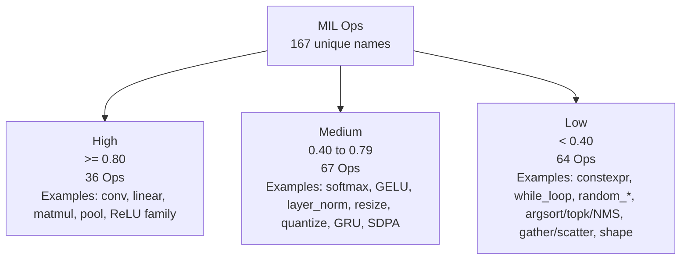

# Analysis of All MIL Operators in coremltools

## Executive Summary

The coremltools API documentation hosted by entity["company","Apple","Cupertino, CA, US"] structures MIL operators into versioned groups from iOS 15 through iOS 18; the documented categories and version modules can be fully traced through the central MIL Ops page, its Sphinx source page, and the Python module index. For this evaluation, I merged identical op names across versions and recorded version deltas in the variants field. citeturn3view0turn4view0turn10view0

The API pages describe semantics, shapes, dtypes, parameters, and version differences, but they contain no explicit mapping to ANE, hardware, or compute units. Therefore every ANE score in this report is an explicit estimate based on op semantics, compute-versus-memory character, access regularity, and typical ANE suitability as of 2026. citeturn22view0turn22view1turn22view2turn22view3

The pattern is clear: dense compute kernels such as `conv`, `linear`, `matmul`, pooling, and simple activations are very easy to plan for ANE; mixed reduction, normalization, resize, quantization, recurrent, and attention ops are moderately plannable; compile-time, control-flow, state, RNG, sorting, shape, gather/scatter, and container ops are weakly plannable. In the API pages examined, I also found no explicit marking of any MIL op as "deprecated" or "undocumented." citeturn13view0turn13view1turn13view2

## Methodology and Assumptions

I enumerated the operators from the central MIL Ops page and its source page, cross-checked the version tables against the Python module index, and then deduplicated names that are the same across versions. In this version, that yields **167 unique documented MIL op names**; iOS15/16/17/18 variants are collapsed into the table field **"Variants / relevant attributes"**. citeturn3view0turn4view0turn10view0

The short descriptions in the tables are compressed English summaries of the corresponding Apple documentation text; the op name itself links to the concrete documentation location. Where Apple documents only deltas for newer versions, the table references the base semantics of the older version and notes the delta briefly. The ANE scores are **not an Apple statement**, but a heuristic estimate. Dense, regular tensor ops receive high scores; irregular memory accesses, dynamic outputs, control flow, state operations, compile-time decompression, or pure shape/container logic receive low scores. citeturn3view0turn8search0turn18view5turn19view0turn19view1turn20view3turn20view4turn21view3turn22view0turn22view1turn22view2turn22view3

## High ANE Plannability

The following matrix groups ops with estimated ANE plannability from **0.80 to 1.00**. Common pattern: dense, regular tensor arithmetic; local windows; linear algebra; or very simple elementwise nonlinearities. Apple documents these families as classic numerical tensor ops with clear shapes, parameters, and relatively small version deltas. citeturn20view0turn18view5turn6view2turn20view3turn20view4turn24view0turn24view1turn24view3turn20view2turn18view4turn16view10

| Family | Op | Official short description | Short function | ANE | Variants / relevant attributes |
|---|---|---|---|---|---|
| Activation | [`relu`](https://apple.github.io/coremltools/source/coremltools.converters.mil.mil.ops.defs.html#coremltools.converters.mil.mil.ops.defs.iOS15.activation.relu) | ReLU: negative values are set to `0`. | Standard activation for dense networks. | 0.98 — Archetypal ANE kernel; often additionally fusible. | — |
| Activation | [`relu6`](https://apple.github.io/coremltools/source/coremltools.converters.mil.mil.ops.defs.html#coremltools.converters.mil.mil.ops.defs.iOS15.activation.relu6) | ReLU6: like ReLU, but capped at `6`. | Mobile-friendly saturating activation. | 0.97 — Elementwise clamp variant; very ANE-friendly. | — |
| Activation | [`sigmoid_hard`](https://apple.github.io/coremltools/source/coremltools.converters.mil.mil.ops.defs.html#coremltools.converters.mil.mil.ops.defs.iOS15.activation.sigmoid_hard) | Hard sigmoid `min(max(alpha*x+beta,0),1)`. | Piecewise-linear sigmoid approximation. | 0.97 — Only affine transform plus clamp; ideal for fixed datapaths. | iOS17+: `alpha`/`beta` may have a different dtype. |
| Activation | [`thresholded_relu`](https://apple.github.io/coremltools/source/coremltools.converters.mil.mil.ops.defs.html#coremltools.converters.mil.mil.ops.defs.iOS15.activation.thresholded_relu) | Passes `x` through only above threshold `alpha`. | Sparsifying threshold activation. | 0.96 — Compare plus select is a very good elementwise case. | iOS17+: `alpha` may have a different dtype. |
| Activation | [`clamped_relu`](https://apple.github.io/coremltools/source/coremltools.converters.mil.mil.ops.defs.html#coremltools.converters.mil.mil.ops.defs.iOS15.activation.clamped_relu) | Capped ReLU with slope `alpha` in the negative region and upper bound `beta`. | Pointwise activation with linear negative branch and saturation. | 0.95 — Pure pointwise arithmetic with constant parameters. | iOS17+: `alpha`/`beta` may have a different dtype. |
| Activation | [`leaky_relu`](https://apple.github.io/coremltools/source/coremltools.converters.mil.mil.ops.defs.html#coremltools.converters.mil.mil.ops.defs.iOS15.activation.leaky_relu) | Leaky ReLU with constant negative slope `alpha`. | Pointwise activation without hard saturation. | 0.95 — Very simple data-parallel kernel. | iOS17+: `alpha` may have a different dtype. |
| Activation | [`linear_activation`](https://apple.github.io/coremltools/source/coremltools.converters.mil.mil.ops.defs.html#coremltools.converters.mil.mil.ops.defs.iOS15.activation.linear_activation) | Linear activation `alpha*x + beta`. | Scaling plus bias as elementwise fusion. | 0.95 — Affine elementwise operations are close to ANE strengths. | iOS17+: `alpha`/`beta` may have a different dtype. |
| Activation | [`prelu`](https://apple.github.io/coremltools/source/coremltools.converters.mil.mil.ops.defs.html#coremltools.converters.mil.mil.ops.defs.iOS15.activation.prelu) | Channelwise Parametric ReLU with `alpha_i` per channel. | Pointwise activation with channel-dependent negative slope. | 0.90 — Still elementwise; broadcast overhead remains small. | iOS17+: `alpha` may have a different dtype. |
| Activation | [`sigmoid`](https://apple.github.io/coremltools/source/coremltools.converters.mil.mil.ops.defs.html#coremltools.converters.mil.mil.ops.defs.iOS15.activation.sigmoid) | Elementwise `sigmoid(x)`. | Gate/probability activation. | 0.85 — Regular, very common point operation. | — |
| Activation | [`softsign`](https://apple.github.io/coremltools/source/coremltools.converters.mil.mil.ops.defs.html#coremltools.converters.mil.mil.ops.defs.iOS15.activation.softsign) | Elementwise `x / (1 + abs(x))`. | Smooth saturating activation without Exp/Log. | 0.84 — Regular elementwise arithmetic remains ANE-friendly. | — |
| Activation | [`silu`](https://apple.github.io/coremltools/source/coremltools.converters.mil.mil.ops.defs.html#coremltools.converters.mil.mil.ops.defs.iOS15.activation.silu) | SiLU/Swish: `x * sigmoid(x)`. | Self-gating activation. | 0.82 — Few elementwise building blocks, often fusible. | — |
| Activation | [`scaled_tanh`](https://apple.github.io/coremltools/source/coremltools.converters.mil.mil.ops.defs.html#coremltools.converters.mil.mil.ops.defs.iOS15.activation.scaled_tanh) | Scaled `tanh(alpha*x)` with additional factor `beta`. | Smooth activation with pre- and post-scaling. | 0.80 — Elementwise with transcendental function; still plannable. | iOS17+: `alpha`/`beta` may have a different dtype. |
| Convolution | [`conv`](https://apple.github.io/coremltools/source/coremltools.converters.mil.mil.ops.defs.html#coremltools.converters.mil.mil.ops.defs.iOS15.conv.conv) | Performs 1D, 2D, or 3D convolution over the input. | Core operator for CNNs and many hybrid blocks. | 0.99 — Dense, local MAC work is the prototypical ANE case. | Groups, dilation, strides, and 3D influence efficiency; iOS17+: weight/bias may have a different dtype. |
| Convolution | [`conv_transpose`](https://apple.github.io/coremltools/source/coremltools.converters.mil.mil.ops.defs.html#coremltools.converters.mil.mil.ops.defs.iOS15.conv.conv_transpose) | Transposed 1D/2D/3D convolution over the input. | Upsampling/decoder operator with weighted scattering. | 0.86 — Still MAC-heavy and regular. | iOS17+: weight/bias may have a different dtype; weight does not have to be const. |
| Elementwise binary | [`mul`](https://apple.github.io/coremltools/source/coremltools.converters.mil.mil.ops.defs.html#coremltools.converters.mil.mil.ops.defs.iOS15.elementwise_binary.mul) | Elementwise `x * y` with broadcasting. | Pointwise multiplication. | 0.97 — Core building block for many fusion paths. | — |
| Elementwise binary | [`add`](https://apple.github.io/coremltools/source/coremltools.converters.mil.mil.ops.defs.html#coremltools.converters.mil.mil.ops.defs.iOS15.elementwise_binary.add) | Elementwise `x + y` with broadcasting. | Pointwise addition. | 0.96 — Very simple data-parallel tensor op. | — |
| Elementwise binary | [`sub`](https://apple.github.io/coremltools/source/coremltools.converters.mil.mil.ops.defs.html#coremltools.converters.mil.mil.ops.defs.iOS15.elementwise_binary.sub) | Elementwise `x - y` with broadcasting. | Pointwise subtraction. | 0.96 — Simple, fully parallel arithmetic. | — |
| Elementwise binary | [`maximum`](https://apple.github.io/coremltools/source/coremltools.converters.mil.mil.ops.defs.html#coremltools.converters.mil.mil.ops.defs.iOS15.elementwise_binary.maximum) | Elementwise maximum with broadcasting. | Pointwise selection of the larger value. | 0.93 — Simple selection type, easy to fuse. | — |
| Elementwise binary | [`minimum`](https://apple.github.io/coremltools/source/coremltools.converters.mil.mil.ops.defs.html#coremltools.converters.mil.mil.ops.defs.iOS15.elementwise_binary.minimum) | Elementwise minimum with broadcasting. | Pointwise selection of the smaller value. | 0.93 — Just as favorable as `maximum`. | — |
| Elementwise unary | [`clip`](https://apple.github.io/coremltools/source/coremltools.converters.mil.mil.ops.defs.html#coremltools.converters.mil.mil.ops.defs.iOS15.elementwise_unary.clip) | Clips `x` elementwise to an interval. | Clamp/saturation operator. | 0.96 — Ideal elementwise fusion candidate. | iOS17+: additional integer dtypes. |
| Elementwise unary | [`abs`](https://apple.github.io/coremltools/source/coremltools.converters.mil.mil.ops.defs.html#coremltools.converters.mil.mil.ops.defs.iOS15.elementwise_unary.abs) | Elementwise absolute value `abs(x)`. | Absolute-value operation. | 0.95 — Very simple point kernel. | — |
| Elementwise unary | [`square`](https://apple.github.io/coremltools/source/coremltools.converters.mil.mil.ops.defs.html#coremltools.converters.mil.mil.ops.defs.iOS15.elementwise_unary.square) | Elementwise `x^2`. | Pointwise squaring. | 0.94 — Simple point kernel with high fusion potential. | — |
| Elementwise unary | [`threshold`](https://apple.github.io/coremltools/source/coremltools.converters.mil.mil.ops.defs.html#coremltools.converters.mil.mil.ops.defs.iOS15.elementwise_unary.threshold) | Thresholds `x` elementwise against a constant value. | Pointwise threshold function. | 0.92 — Compare plus select maps very well to ANE. | — |
| Elementwise unary | [`tanh`](https://apple.github.io/coremltools/source/coremltools.converters.mil.mil.ops.defs.html#coremltools.converters.mil.mil.ops.defs.iOS15.elementwise_unary.tanh) | Elementwise hyperbolic tangent. | Classic saturating activation. | 0.82 — Established point kernel in sequence models. | — |
| Elementwise unary | [`rsqrt`](https://apple.github.io/coremltools/source/coremltools.converters.mil.mil.ops.defs.html#coremltools.converters.mil.mil.ops.defs.iOS15.elementwise_unary.rsqrt) | Elementwise reciprocal square root with `epsilon`. | Important in normalization paths. | 0.80 — Common in normalization and attention pipelines. | iOS17+: additional integer dtypes. |
| Image resizing | [`upsample_nearest_neighbor`](https://apple.github.io/coremltools/source/coremltools.converters.mil.mil.ops.defs.html#coremltools.converters.mil.mil.ops.defs.iOS15.image_resizing.upsample_nearest_neighbor) | Nearest-neighbor upsampling of the input. | Specialized discrete upscaler. | 0.92 — Very simple, deterministic layout/sampling path. | Scale factors determine efficiency. |
| Image resizing | [`resize_nearest_neighbor`](https://apple.github.io/coremltools/source/coremltools.converters.mil.mil.ops.defs.html#coremltools.converters.mil.mil.ops.defs.iOS15.image_resizing.resize_nearest_neighbor) | Nearest-neighbor resize along spatial axes. | Simple discrete upscaling/downscaling. | 0.90 — Very regular addressing without bilinear mixtures. | Scale factors and axis choice matter. |
| Image resizing | [`upsample_bilinear`](https://apple.github.io/coremltools/source/coremltools.converters.mil.mil.ops.defs.html#coremltools.converters.mil.mil.ops.defs.iOS15.image_resizing.upsample_bilinear) | Bilinear upsampling of the input. | Specialized bilinear upscaler. | 0.86 — Static upsampling is easy to plan. | iOS16+: `half_pixel_centers`. |
| Image resizing | [`resize_bilinear`](https://apple.github.io/coremltools/source/coremltools.converters.mil.mil.ops.defs.html#coremltools.converters.mil.mil.ops.defs.iOS15.image_resizing.resize_bilinear) | Bilinear resize along spatial axes. | Regular dense image resize. | 0.82 — Regular raster interpolation is hardware-suitable. | `align_corners`/sampling convention relevant. |
| Linear | [`linear`](https://apple.github.io/coremltools/source/coremltools.converters.mil.mil.ops.defs.html#coremltools.converters.mil.mil.ops.defs.iOS15.linear.linear) | Computes `x * weight.T + bias`. | Fully connected affine projection. | 0.98 — Dense matrix work fits ANE extremely well. | iOS17+: weight/bias may have a different dtype. |
| Linear | [`matmul`](https://apple.github.io/coremltools/source/coremltools.converters.mil.mil.ops.defs.html#coremltools.converters.mil.mil.ops.defs.iOS15.linear.matmul) | N-dimensional batch matrix multiplication with broadcasting. | Generic dense contraction kernel. | 0.97 — Batch matmul is one of the clearest ANE target structures. | `transpose_x`/`transpose_y` and broadcasting matter; iOS17+: mixed dtypes if one side is const. |
| Normalization | [`batch_norm`](https://apple.github.io/coremltools/source/coremltools.converters.mil.mil.ops.defs.html#coremltools.converters.mil.mil.ops.defs.iOS15.normalization.batch_norm) | Normalizes `x` with `mean`, `variance`, optional `gamma`, and `beta`. | Channelwise normalization with affine post-scaling. | 0.90 — Very common and often fusible. | iOS17+: different dtypes for statistics/scale parameters allowed. |
| Pooling | [`max_pool`](https://apple.github.io/coremltools/source/coremltools.converters.mil.mil.ops.defs.html#coremltools.converters.mil.mil.ops.defs.iOS15.pool.max_pool) | Max pooling over 1D, 2D, or 3D spatial dimensions. | Window-based maximum reduction. | 0.93 — Regular local reduction fits ANE very well. | Kernel size, stride, padding, and 3D relevant. |
| Pooling | [`avg_pool`](https://apple.github.io/coremltools/source/coremltools.converters.mil.mil.ops.defs.html#coremltools.converters.mil.mil.ops.defs.iOS15.pool.avg_pool) | Average pooling over 1D, 2D, or 3D spatial dimensions. | Window-based mean compaction. | 0.92 — Regular window reduction maps well. | Kernel size, stride, padding, and 3D relevant. |
| Reduction | [`reduce_sum`](https://apple.github.io/coremltools/source/coremltools.converters.mil.mil.ops.defs.html#coremltools.converters.mil.mil.ops.defs.iOS15.reduction.reduce_sum) | Reduces to the sum over axes. | Classic sum reduction. | 0.82 — Standard reduction with good ANE suitability. | Axis choice and `keep_dims` relevant. |
| Reduction | [`reduce_max`](https://apple.github.io/coremltools/source/coremltools.converters.mil.mil.ops.defs.html#coremltools.converters.mil.mil.ops.defs.iOS15.reduction.reduce_max) | Reduces to the maximum over axes. | Value reduction over tensor axes. | 0.80 — Regular max reduction is hardware-suitable. | Axis choice and `keep_dims` relevant. |

## Medium ANE Plannability

These ops are estimated at **0.40 to 0.79**. Typical cases are transcendental point functions, more complex reductions, normalizations with flexible axes, more generic resize/transformation paths, explicit quantization, and recurrent or attention-like blocks: still often ANE-capable, but less direct and less often an "ideally shaped" primary kernel. citeturn20view1turn20view3turn18view4turn17view2turn17view3turn17view7turn16view10turn21view2turn18view3turn19view2turn24view0turn24view1turn24view3

| Family | Op | Official short description | Short function | ANE | Variants / relevant attributes |
|---|---|---|---|---|---|
| Activation | [`softmax`](https://apple.github.io/coremltools/source/coremltools.converters.mil.mil.ops.defs.html#coremltools.converters.mil.mil.ops.defs.iOS15.activation.softmax) | Normalizes with `exp(x)/sum(exp(x))` along an axis. | Converts logits into normalized weights/probabilities. | 0.78 — Exponential plus reduction; plannable, but not trivial. | Axis relevant; large sequence axes increase reduction pressure. |
| Activation | [`elu`](https://apple.github.io/coremltools/source/coremltools.converters.mil.mil.ops.defs.html#coremltools.converters.mil.mil.ops.defs.iOS15.activation.elu) | ELU: positive values stay unchanged, negative values are transformed as `alpha*(e^x-1)`. | Nonlinear pointwise activation with exponential term. | 0.75 — Elementwise, but more expensive than ReLU. | iOS17+: `alpha` may have a different dtype. |
| Activation | [`softplus_parametric`](https://apple.github.io/coremltools/source/coremltools.converters.mil.mil.ops.defs.html#coremltools.converters.mil.mil.ops.defs.iOS15.activation.softplus_parametric) | Channelwise `alpha_i * log(1 + e^(beta_i*x_i))`. | Softplus with per-channel scaling. | 0.72 — Regular, but Exp/Log plus broadcast reduce efficiency. | iOS17+: `alpha`/`beta` may have a different dtype. |
| Activation | [`gelu`](https://apple.github.io/coremltools/source/coremltools.converters.mil.mil.ops.defs.html#coremltools.converters.mil.mil.ops.defs.iOS15.activation.gelu) | Gaussian Error Linear Unit in exact or approximated form. | Common Transformer activation. | 0.70 — Often fusible, but more complex than piecewise-linear activations. | Modes `EXACT`, `TANH_APPROXIMATION`, `SIGMOID_APPROXIMATION`. |
| Activation | [`softplus`](https://apple.github.io/coremltools/source/coremltools.converters.mil.mil.ops.defs.html#coremltools.converters.mil.mil.ops.defs.iOS15.activation.softplus) | Elementwise `log(1+e^x)`. | Smooth ReLU-like activation. | 0.68 — Elementwise chain with Exp/Log cost. | — |
| Control flow | [`select`](https://apple.github.io/coremltools/source/coremltools.converters.mil.mil.ops.defs.html#coremltools.converters.mil.mil.ops.defs.iOS15.control_flow.select) | Selects elementwise from `a` or `b` depending on `cond`. | Broadcastable mux/where operation. | 0.72 — Elementwise predication pattern is easy to plan. | If `a`/`b` are missing, an index output is produced. |
| Elementwise binary | [`equal`](https://apple.github.io/coremltools/source/coremltools.converters.mil.mil.ops.defs.html#coremltools.converters.mil.mil.ops.defs.iOS15.elementwise_binary.equal) | Elementwise `x == y` with broadcasting. | Comparison operator for masking. | 0.68 — Regular point operation, but not a primary throughput driver. | — |
| Elementwise binary | [`greater`](https://apple.github.io/coremltools/source/coremltools.converters.mil.mil.ops.defs.html#coremltools.converters.mil.mil.ops.defs.iOS15.elementwise_binary.greater) | Elementwise `x > y` with broadcasting. | Mask generation by comparison. | 0.68 — Plannable, but mostly helper logic. | — |
| Elementwise binary | [`greater_equal`](https://apple.github.io/coremltools/source/coremltools.converters.mil.mil.ops.defs.html#coremltools.converters.mil.mil.ops.defs.iOS15.elementwise_binary.greater_equal) | Elementwise `x >= y` with broadcasting. | Mask generation by comparison. | 0.68 — Simple, but rarely a dominant ANE kernel. | — |
| Elementwise binary | [`less`](https://apple.github.io/coremltools/source/coremltools.converters.mil.mil.ops.defs.html#coremltools.converters.mil.mil.ops.defs.iOS15.elementwise_binary.less) | Elementwise `x < y` with broadcasting. | Mask generation by comparison. | 0.68 — Data-parallel, but mostly a helper op. | — |
| Elementwise binary | [`less_equal`](https://apple.github.io/coremltools/source/coremltools.converters.mil.mil.ops.defs.html#coremltools.converters.mil.mil.ops.defs.iOS15.elementwise_binary.less_equal) | Elementwise `x <= y` with broadcasting. | Mask generation by comparison. | 0.68 — Like other comparisons, more side logic than primary kernel. | — |
| Elementwise binary | [`not_equal`](https://apple.github.io/coremltools/source/coremltools.converters.mil.mil.ops.defs.html#coremltools.converters.mil.mil.ops.defs.iOS15.elementwise_binary.not_equal) | Elementwise `x != y` with broadcasting. | Mask generation through inequality test. | 0.68 — Simple, but not throughput-defining. | — |
| Elementwise binary | [`logical_and`](https://apple.github.io/coremltools/source/coremltools.converters.mil.mil.ops.defs.html#coremltools.converters.mil.mil.ops.defs.iOS15.elementwise_binary.logical_and) | Elementwise logical AND with broadcasting. | Boolean mask combination. | 0.60 — Feasible, but less typical for ANE main paths. | — |
| Elementwise binary | [`logical_or`](https://apple.github.io/coremltools/source/coremltools.converters.mil.mil.ops.defs.html#coremltools.converters.mil.mil.ops.defs.iOS15.elementwise_binary.logical_or) | Elementwise logical OR with broadcasting. | Boolean mask combination. | 0.60 — Boolean helper logic rather than primary kernel. | — |
| Elementwise binary | [`real_div`](https://apple.github.io/coremltools/source/coremltools.converters.mil.mil.ops.defs.html#coremltools.converters.mil.mil.ops.defs.iOS15.elementwise_binary.real_div) | Elementwise `x / y` with broadcasting. | Floating-point division. | 0.55 — Data-parallel, but less attractive than Add/Mul. | — |
| Elementwise binary | [`logical_xor`](https://apple.github.io/coremltools/source/coremltools.converters.mil.mil.ops.defs.html#coremltools.converters.mil.mil.ops.defs.iOS15.elementwise_binary.logical_xor) | Elementwise logical XOR with broadcasting. | Boolean mask combination. | 0.58 — Regular, but relatively peripheral. | — |
| Elementwise binary | [`floor_div`](https://apple.github.io/coremltools/source/coremltools.converters.mil.mil.ops.defs.html#coremltools.converters.mil.mil.ops.defs.iOS15.elementwise_binary.floor_div) | Elementwise `floor(x / y)` with broadcasting. | Integer/rounded-down division. | 0.42 — Division plus rounding is much less attractive than Add/Mul. | — |
| Elementwise unary | [`sqrt`](https://apple.github.io/coremltools/source/coremltools.converters.mil.mil.ops.defs.html#coremltools.converters.mil.mil.ops.defs.iOS15.elementwise_unary.sqrt) | Elementwise square root. | Square-root operator. | 0.78 — Common in normalization/distance paths. | — |
| Elementwise unary | [`inverse`](https://apple.github.io/coremltools/source/coremltools.converters.mil.mil.ops.defs.html#coremltools.converters.mil.mil.ops.defs.iOS15.elementwise_unary.inverse) | Elementwise reciprocal with `epsilon`. | Inverts values as a point operation. | 0.72 — Good data parallelism, but more expensive than primitive arithmetic. | iOS17+: additional integer dtypes. |
| Elementwise unary | [`ceil`](https://apple.github.io/coremltools/source/coremltools.converters.mil.mil.ops.defs.html#coremltools.converters.mil.mil.ops.defs.iOS15.elementwise_unary.ceil) | Elementwise ceiling. | Rounding operator. | 0.70 — Pointwise and simple. | — |
| Elementwise unary | [`floor`](https://apple.github.io/coremltools/source/coremltools.converters.mil.mil.ops.defs.html#coremltools.converters.mil.mil.ops.defs.iOS15.elementwise_unary.floor) | Elementwise floor toward `-∞`. | Rounding operator. | 0.70 — Regular point kernel. | — |
| Elementwise unary | [`exp`](https://apple.github.io/coremltools/source/coremltools.converters.mil.mil.ops.defs.html#coremltools.converters.mil.mil.ops.defs.iOS15.elementwise_unary.exp) | Elementwise `e^x`. | Exponential function. | 0.68 — Common enough, but more expensive than linear/clamp-based ops. | — |
| Elementwise unary | [`round`](https://apple.github.io/coremltools/source/coremltools.converters.mil.mil.ops.defs.html#coremltools.converters.mil.mil.ops.defs.iOS15.elementwise_unary.round) | Elementwise rounding to nearest integer. | Rounding operator. | 0.68 — Pointwise and simple. | — |
| Elementwise unary | [`log`](https://apple.github.io/coremltools/source/coremltools.converters.mil.mil.ops.defs.html#coremltools.converters.mil.mil.ops.defs.iOS15.elementwise_unary.log) | Elementwise natural logarithm with `epsilon`. | Log transformation. | 0.65 — Elementwise, but transcendental. | iOS17+: additional integer dtypes. |
| Elementwise unary | [`sign`](https://apple.github.io/coremltools/source/coremltools.converters.mil.mil.ops.defs.html#coremltools.converters.mil.mil.ops.defs.iOS15.elementwise_unary.sign) | Elementwise sign. | Reduces values to sign information. | 0.65 — Simple, but semantically mostly helper logic. | — |
| Elementwise unary | [`exp2`](https://apple.github.io/coremltools/source/coremltools.converters.mil.mil.ops.defs.html#coremltools.converters.mil.mil.ops.defs.iOS15.elementwise_unary.exp2) | Elementwise `2^x`. | Base-2 exponential function. | 0.62 — Similar to `exp`, but less standard. | — |
| Elementwise unary | [`cast`](https://apple.github.io/coremltools/source/coremltools.converters.mil.mil.ops.defs.html#coremltools.converters.mil.mil.ops.defs.iOS15.elementwise_unary.cast) | Casts `x` to target type `dtype`. | Type conversion. | 0.55 — Often preparation/postprocessing or fusion. | iOS17+: additional integer dtypes. |
| Elementwise unary | [`logical_not`](https://apple.github.io/coremltools/source/coremltools.converters.mil.mil.ops.defs.html#coremltools.converters.mil.mil.ops.defs.iOS15.elementwise_unary.logical_not) | Elementwise logical NOT. | Mask inversion. | 0.60 — Boolean point logic is feasible, but rarely a main path. | — |
| Elementwise unary | [`cos`](https://apple.github.io/coremltools/source/coremltools.converters.mil.mil.ops.defs.html#coremltools.converters.mil.mil.ops.defs.iOS15.elementwise_unary.cos) | Elementwise cosine. | Trigonometric function. | 0.45 — Transcendental special function with only moderate direct ANE suitability. | — |
| Elementwise unary | [`sin`](https://apple.github.io/coremltools/source/coremltools.converters.mil.mil.ops.defs.html#coremltools.converters.mil.mil.ops.defs.iOS15.elementwise_unary.sin) | Elementwise sine. | Trigonometric function. | 0.45 — Special function with moderate direct suitability. | — |
| Elementwise unary | [`atan`](https://apple.github.io/coremltools/source/coremltools.converters.mil.mil.ops.defs.html#coremltools.converters.mil.mil.ops.defs.iOS15.elementwise_unary.atan) | Elementwise arctangent. | Inverse trigonometric function. | 0.45 — Purely elementwise, but transcendental. | — |
| Elementwise unary | [`erf`](https://apple.github.io/coremltools/source/coremltools.converters.mil.mil.ops.defs.html#coremltools.converters.mil.mil.ops.defs.iOS15.elementwise_unary.erf) | Elementwise error function. | Special function, relevant for exact GELU among other uses. | 0.45 — Plannable, but not a particularly cheap standard kernel. | — |
| Elementwise unary | [`acos`](https://apple.github.io/coremltools/source/coremltools.converters.mil.mil.ops.defs.html#coremltools.converters.mil.mil.ops.defs.iOS15.elementwise_unary.acos) | Elementwise arccosine. | Inverse trigonometric function. | 0.42 — Heavier than primitive point arithmetic. | — |
| Elementwise unary | [`asin`](https://apple.github.io/coremltools/source/coremltools.converters.mil.mil.ops.defs.html#coremltools.converters.mil.mil.ops.defs.iOS15.elementwise_unary.asin) | Elementwise arcsine. | Inverse trigonometric function. | 0.42 — Like `acos`, numerically more expensive. | — |
| Elementwise unary | [`cosh`](https://apple.github.io/coremltools/source/coremltools.converters.mil.mil.ops.defs.html#coremltools.converters.mil.mil.ops.defs.iOS15.elementwise_unary.cosh) | Elementwise hyperbolic cosine. | Hyperbolic special function. | 0.40 — More complex than primitive point arithmetic. | — |
| Elementwise unary | [`sinh`](https://apple.github.io/coremltools/source/coremltools.converters.mil.mil.ops.defs.html#coremltools.converters.mil.mil.ops.defs.iOS15.elementwise_unary.sinh) | Elementwise hyperbolic sine. | Hyperbolic special function. | 0.40 — Less typical and numerically heavier. | — |
| Image resizing | [`resize`](https://apple.github.io/coremltools/source/coremltools.converters.mil.mil.ops.defs.html#coremltools.converters.mil.mil.ops.defs.iOS17.image_resizing.resize) | Resizes the input over the rightmost `resized_dims` dimensions. | Generic resize op. | 0.78 — More regular than free resample, but more generic than specialized variants. | `resized_dims`, mode, and target shape are decisive. |
| Image resizing | [`crop_resize`](https://apple.github.io/coremltools/source/coremltools.converters.mil.mil.ops.defs.html#coremltools.converters.mil.mil.ops.defs.iOS15.image_resizing.crop_resize) | Crops boxes and scales them to target size. | ROI extraction plus resize. | 0.62 — More regular than free resampling, but still coordinate-driven. | iOS16/17 extend types and parameters; box format, sampling mode, and `pad_value` matter. |
| Image resizing | [`affine`](https://apple.github.io/coremltools/source/coremltools.converters.mil.mil.ops.defs.html#coremltools.converters.mil.mil.ops.defs.iOS15.image_resizing.affine) | Applies an affine transform to an image/tensor field. | Geometric transform with sampling. | 0.48 — Coordinate transform plus interpolation is only moderately ANE-friendly. | Sampling mode/coordinate model decisive. |
| Image resizing | [`resample`](https://apple.github.io/coremltools/source/coremltools.converters.mil.mil.ops.defs.html#coremltools.converters.mil.mil.ops.defs.iOS15.image_resizing.resample) | Resamples `x` at given `coordinates`; `sampling_mode` determines interpolation. | General geometric sampling. | 0.45 — Free coordinates create irregular read directions. | iOS16/17 extend coordinate dtypes; `sampling_mode` strongly relevant. |
| Linear | [`einsum`](https://apple.github.io/coremltools/source/coremltools.converters.mil.mil.ops.defs.html#coremltools.converters.mil.mil.ops.defs.iOS15.linear.einsum) | Einsum contraction; only a few equation forms are documented. | Dense tensor contraction, often matmul-like. | 0.76 — Good when it falls onto regular contractions. | Only certain equations are allowed. |
| Normalization | [`instance_norm`](https://apple.github.io/coremltools/source/coremltools.converters.mil.mil.ops.defs.html#coremltools.converters.mil.mil.ops.defs.iOS15.normalization.instance_norm) | Applies instance normalization to the input. | Per-instance/per-channel normalization. | 0.78 — Reduction plus affine steps are easy to plan. | iOS17+: mixed dtypes allowed. |
| Normalization | [`l2_norm`](https://apple.github.io/coremltools/source/coremltools.converters.mil.mil.ops.defs.html#coremltools.converters.mil.mil.ops.defs.iOS15.normalization.l2_norm) | Normalizes along axes to the L2 norm. | Normalization op with sum-of-squares and root. | 0.74 — Plannable, but more complex than Sum/Max/Mean. | iOS17+: mixed dtypes allowed. |
| Normalization | [`layer_norm`](https://apple.github.io/coremltools/source/coremltools.converters.mil.mil.ops.defs.html#coremltools.converters.mil.mil.ops.defs.iOS15.normalization.layer_norm) | Applies LayerNorm to the input. | Normalizes over feature axes. | 0.72 — Common, but axis reduction makes peak planning somewhat harder. | iOS17+: mixed dtypes allowed. |
| Normalization | [`local_response_norm`](https://apple.github.io/coremltools/source/coremltools.converters.mil.mil.ops.defs.html#coremltools.converters.mil.mil.ops.defs.iOS15.normalization.local_response_norm) | Applies local response normalization over neighboring channels. | Older window-based channel normalization. | 0.48 — Less attractive than BatchNorm/LayerNorm. | iOS17+: mixed dtypes allowed. |
| Pooling | [`l2_pool`](https://apple.github.io/coremltools/source/coremltools.converters.mil.mil.ops.defs.html#coremltools.converters.mil.mil.ops.defs.iOS15.pool.l2_pool) | L2 pooling over spatial windows. | Window reduction with square sum and root. | 0.75 — Regular, but more expensive than max/avg. | Kernel size and 3D influence cost. |
| Quantization | [`quantize`](https://apple.github.io/coremltools/source/coremltools.converters.mil.mil.ops.defs.html#coremltools.converters.mil.mil.ops.defs.iOS17.quantization_ops.quantize) | Performs affine/linear quantization on an input tensor. | Converts FP data into int8/uint8 representation. | 0.48 — Explicit quantization is often preparation/postprocessing rather than target kernel. | `scale`/`zero_point`/`axis` determine broadcast and shape. |
| Quantization | [`dequantize`](https://apple.github.io/coremltools/source/coremltools.converters.mil.mil.ops.defs.html#coremltools.converters.mil.mil.ops.defs.iOS17.quantization_ops.dequantize) | Performs affine/linear dequantization of an input. | Converts quantized data back to FP. | 0.45 — Standalone usually a pre-stage/fusion rather than primary kernel. | `scale`/`zero_point`/`axis` are decisive. |
| Recurrent | [`rnn`](https://apple.github.io/coremltools/source/coremltools.converters.mil.mil.ops.defs.html#coremltools.converters.mil.mil.ops.defs.iOS15.recurrent.rnn) | Classic Recurrent Neural Network. | Simplest recurrent sequence block. | 0.66 — Less complex than LSTM/GRU, but still sequential. | iOS17+: fp16. |
| Recurrent | [`gru`](https://apple.github.io/coremltools/source/coremltools.converters.mil.mil.ops.defs.html#coremltools.converters.mil.mil.ops.defs.iOS15.recurrent.gru) | Gated Recurrent Unit with documented gate equations. | Recurrent block with three gates. | 0.64 — Inner matmuls are good, but the time axis limits parallelism. | iOS17+: fp16; iOS18+: `reset_after`, `input_bias`. |
| Recurrent | [`lstm`](https://apple.github.io/coremltools/source/coremltools.converters.mil.mil.ops.defs.html#coremltools.converters.mil.mil.ops.defs.iOS15.recurrent.lstm) | Long Short-Term Memory with cell and hidden state. | Recurrent block with four gates and memory state. | 0.58 — More gate and state logic lowers direct suitability. | iOS17+: fp16. |
| Reduction | [`reduce_mean`](https://apple.github.io/coremltools/source/coremltools.converters.mil.mil.ops.defs.html#coremltools.converters.mil.mil.ops.defs.iOS15.reduction.reduce_mean) | Reduces to the mean over axes. | Value reduction plus scaling. | 0.78 — ANE-friendly reduction. | Axis choice and `keep_dims` relevant. |
| Reduction | [`reduce_min`](https://apple.github.io/coremltools/source/coremltools.converters.mil.mil.ops.defs.html#coremltools.converters.mil.mil.ops.defs.iOS15.reduction.reduce_min) | Reduces to the minimum over axes. | Value reduction over tensor axes. | 0.78 — Regular and easy to plan. | Axis choice and `keep_dims` relevant. |
| Reduction | [`reduce_sum_square`](https://apple.github.io/coremltools/source/coremltools.converters.mil.mil.ops.defs.html#coremltools.converters.mil.mil.ops.defs.iOS15.reduction.reduce_sum_square) | Reduces over the sum of squared values. | Pre-stage for many norm/energy paths. | 0.74 — Squaring plus summing remains regular. | Axis choice and `keep_dims` relevant. |
| Reduction | [`reduce_l2_norm`](https://apple.github.io/coremltools/source/coremltools.converters.mil.mil.ops.defs.html#coremltools.converters.mil.mil.ops.defs.iOS15.reduction.reduce_l2_norm) | Reduces over the L2 norm. | Square sum plus root reduction. | 0.68 — Plannable, but more complex than Sum/Max. | Axis choice and `keep_dims` relevant. |
| Reduction | [`reduce_l1_norm`](https://apple.github.io/coremltools/source/coremltools.converters.mil.mil.ops.defs.html#coremltools.converters.mil.mil.ops.defs.iOS15.reduction.reduce_l1_norm) | Reduces over the L1 norm. | Absolute value plus sum reduction. | 0.66 — Regular, but with additional preprocessing. | Axis choice and `keep_dims` relevant. |
| Reduction | [`reduce_log_sum_exp`](https://apple.github.io/coremltools/source/coremltools.converters.mil.mil.ops.defs.html#coremltools.converters.mil.mil.ops.defs.iOS15.reduction.reduce_log_sum_exp) | Reduces over the `log-sum-exp` expression. | Stable aggregation for logits/energies. | 0.56 — Reduction plus Exp/Log lowers suitability. | Axis choice and stability relevant. |
| Reduction | [`reduce_log_sum`](https://apple.github.io/coremltools/source/coremltools.converters.mil.mil.ops.defs.html#coremltools.converters.mil.mil.ops.defs.iOS15.reduction.reduce_log_sum) | Reduces over a log-sum path. | Logarithmic sum reduction. | 0.50 — Reduction plus transcendental function. | Axis choice and numerical stability relevant. |
| Reduction | [`reduce_prod`](https://apple.github.io/coremltools/source/coremltools.converters.mil.mil.ops.defs.html#coremltools.converters.mil.mil.ops.defs.iOS15.reduction.reduce_prod) | Reduces to the product over axes. | Multiplicative aggregation. | 0.44 — Numerically more delicate and less often prioritized. | Axis choice and `keep_dims` relevant. |
| Tensor op | [`concat`](https://apple.github.io/coremltools/source/coremltools.converters.mil.mil.ops.defs.html#coremltools.converters.mil.mil.ops.defs.iOS15.tensor_operation.concat) | Concatenates tensors along an axis. | Layout/pack operation. | 0.46 — Regular, but primarily bandwidth-driven. | Static axis and similar layouts help. |
| Tensor transform | [`depth_to_space`](https://apple.github.io/coremltools/source/coremltools.converters.mil.mil.ops.defs.html#coremltools.converters.mil.mil.ops.defs.iOS15.tensor_transformation.depth_to_space) | Rearranges elements from depth/channel into spatial dimensions. | Pixel-shuffle-like reorganization. | 0.72 — Very regular permutation with clear structure. | Block size decisive. |
| Tensor transform | [`pixel_shuffle`](https://apple.github.io/coremltools/source/coremltools.converters.mil.mil.ops.defs.html#coremltools.converters.mil.mil.ops.defs.iOS15.tensor_transformation.pixel_shuffle) | Rearranges elements from depth into spatial dimensions. | Super-resolution/upscaling rearrangement. | 0.72 — Regular, deterministic relocation. | Upscale factor relevant. |
| Tensor transform | [`space_to_depth`](https://apple.github.io/coremltools/source/coremltools.converters.mil.mil.ops.defs.html#coremltools.converters.mil.mil.ops.defs.iOS15.tensor_transformation.space_to_depth) | Rearranges elements from spatial dimensions into depth/channel. | Inverse of `depth_to_space`. | 0.72 — Very structured permutation. | Block size decisive. |
| Tensor transform | [`pixel_unshuffle`](https://apple.github.io/coremltools/source/coremltools.converters.mil.mil.ops.defs.html#coremltools.converters.mil.mil.ops.defs.iOS16.tensor_transformation.pixel_unshuffle) | Rearranges elements from spatial dimensions into depth; inverse of `pixel_shuffle`. | Specialized downscale rearrangement. | 0.72 — Regular permutation with clear structure. | Downscale factor relevant. |
| Tensor transform | [`batch_to_space`](https://apple.github.io/coremltools/source/coremltools.converters.mil.mil.ops.defs.html#coremltools.converters.mil.mil.ops.defs.iOS15.tensor_transformation.batch_to_space) | Moves batch content into spatial dimensions. | Regular layout rearrangement. | 0.52 — Regular enough, but primarily data rearrangement. | Block sizes and crops influence the lowering. |
| Tensor transform | [`space_to_batch`](https://apple.github.io/coremltools/source/coremltools.converters.mil.mil.ops.defs.html#coremltools.converters.mil.mil.ops.defs.iOS15.tensor_transformation.space_to_batch) | Moves spatial portions into the batch dimension. | Layout transform for dilation-like patterns. | 0.44 — Regular, but data-movement-dominant. | Block sizes and padding matter. |
| Transformers | [`scaled_dot_product_attention`](https://apple.github.io/coremltools/source/coremltools.converters.mil.mil.ops.defs.html#coremltools.converters.mil.mil.ops.defs.iOS18.transformers.scaled_dot_product_attention) | Computes Scaled Dot Product Attention over query, key, and value with optional mask. | Combines matmul, scaling, masking, softmax, and value aggregation. | 0.74 — Core matmuls are ANE-friendly, but softmax and masking make the overall op more complex. | Mask type/shape and sequence dimensions are the main drivers. |

## Low ANE Plannability

This matrix groups ops below **0.40**. These are primarily compile-time decompression, control flow, list and state logic, randomness, sorting/top-k/NMS, shape introspection, gather/scatter, and general slice/transpose/index transformations. The recurring reason is not "too little compute," but too much irregularity, dynamism, or metadata character. citeturn8search0turn19view0turn19view1turn25view0turn25view1turn17view4turn17view5turn18view0turn18view1turn25view3turn25view4turn18view2turn17view0turn17view1turn20view5turn21view0turn21view1turn21view3

| Family | Op | Official short description | Short function | ANE | Variants / relevant attributes |
|---|---|---|---|---|---|
| Constexpr | [`constexpr_affine_dequantize`](https://apple.github.io/coremltools/source/coremltools.converters.mil.mil.ops.defs.html#coremltools.converters.mil.mil.ops.defs.iOS16.constexpr_ops.constexpr_affine_dequantize) | Compile-time op for dequantizing constant affine/linear quantized data. | Reconstructs constant weights/activations from quantization parameters. | 0.05 — Decompression at load time or runtime; not a regular ANE compute kernel. | `scale`/`zero_point`/`axis` determine broadcast and layout. |
| Constexpr | [`constexpr_blockwise_shift_scale`](https://apple.github.io/coremltools/source/coremltools.converters.mil.mil.ops.defs.html#coremltools.converters.mil.mil.ops.defs.iOS18.compression.constexpr_blockwise_shift_scale) | Compile-time op for blockwise shift-scale dequantization of constant inputs. | Decompresses block-quantized constants. | 0.05 — Weight/constant materialization is the focus. | Block size and `offset` influence the pattern. |
| Constexpr | [`constexpr_lut_to_dense`](https://apple.github.io/coremltools/source/coremltools.converters.mil.mil.ops.defs.html#coremltools.converters.mil.mil.ops.defs.iOS16.constexpr_ops.constexpr_lut_to_dense) | Compile-time op for decompressing a lookup table into a dense tensor. | Unpacks palettized weights. | 0.05 — Preparation logic for weights, not a regular ANE target path. | iOS18+: block/vectorized palettization. |
| Constexpr | [`constexpr_sparse_to_dense`](https://apple.github.io/coremltools/source/coremltools.converters.mil.mil.ops.defs.html#coremltools.converters.mil.mil.ops.defs.iOS16.constexpr_ops.constexpr_sparse_to_dense) | Compile-time op for densifying constant inputs. | Converts bitmask sparsity into dense constants. | 0.05 — Decompression/materialization rather than inference compute. | iOS18+: `uint1` mask, more dtypes. |
| Constexpr | [`constexpr_cast`](https://apple.github.io/coremltools/source/coremltools.converters.mil.mil.ops.defs.html#coremltools.converters.mil.mil.ops.defs.iOS16.constexpr_ops.constexpr_cast) | Compile-time op for casting constant inputs. | Constant preprocessing. | 0.00 — Standalone ANE planning is practically irrelevant. | iOS18 variant treats parameters as inputs instead of attributes. |
| Constexpr | [`constexpr_lut_to_sparse`](https://apple.github.io/coremltools/source/coremltools.converters.mil.mil.ops.defs.html#coremltools.converters.mil.mil.ops.defs.iOS18.compression.constexpr_lut_to_sparse) | Compile-time op for de-palettizing into sparse-represented output. | Intermediate format for palettized and sparse constants. | 0.00 — Clear precompute/load logic. | Typically before `constexpr_sparse_to_dense`. |
| Constexpr | [`constexpr_sparse_blockwise_shift_scale`](https://apple.github.io/coremltools/source/coremltools.converters.mil.mil.ops.defs.html#coremltools.converters.mil.mil.ops.defs.iOS18.compression.constexpr_sparse_blockwise_shift_scale) | Compile-time sparse-to-sparse dequantization only on nonzero values. | Applies blockwise dequantization to sparse constants. | 0.00 — Not an ANE main kernel, but constant preparation. | Often followed by `constexpr_sparse_to_dense`. |
| Control flow | [`cond`](https://apple.github.io/coremltools/source/coremltools.converters.mil.mil.ops.defs.html#coremltools.converters.mil.mil.ops.defs.iOS15.control_flow.cond) | Conditional execution with identical return types in both branches. | Graph control flow for selecting a subgraph. | 0.08 — Branches are typically orchestrated by runtime/CPU. | Branch type equality required. |
| Control flow | [`list_gather`](https://apple.github.io/coremltools/source/coremltools.converters.mil.mil.ops.defs.html#coremltools.converters.mil.mil.ops.defs.iOS15.control_flow.list_gather) | Returns selected list values as a packed tensor. | Collects multiple list elements into a tensor. | 0.05 — Container-driven pack/gather logic. | Index pattern and list length are critical. |
| Control flow | [`while_loop`](https://apple.github.io/coremltools/source/coremltools.converters.mil.mil.ops.defs.html#coremltools.converters.mil.mil.ops.defs.iOS15.control_flow.while_loop) | Repeats the body while `cond` is true. | Dynamic loop control flow. | 0.04 — Dynamic loops undermine the static kernel character of ANE. | Loop variables and iteration count are the main obstacle. |
| Control flow | [`Const`](https://apple.github.io/coremltools/source/coremltools.converters.mil.mil.ops.defs.html#coremltools.converters.mil.mil.ops.defs.iOS15.control_flow.Const) | Base class that returns constant values. | Constant source in the MIL graph. | 0.00 — Constants are materialized or folded. | `mode` (`immediate_value`/`file_value`) influences storage. |
| Control flow | [`make_list`](https://apple.github.io/coremltools/source/coremltools.converters.mil.mil.ops.defs.html#coremltools.converters.mil.mil.ops.defs.iOS15.control_flow.make_list) | Creates a list of tensor elements with similar shape. | Container initialization in the graph. | 0.00 — List management is runtime/interpreter logic. | `dynamic_length`, `elem_shape`, `dtype` relevant. |
| Control flow | [`list_length`](https://apple.github.io/coremltools/source/coremltools.converters.mil.mil.ops.defs.html#coremltools.converters.mil.mil.ops.defs.iOS15.control_flow.list_length) | Returns the length of `ls`. | Metadata query over container state. | 0.00 — Pure management operation. | — |
| Control flow | [`list_write`](https://apple.github.io/coremltools/source/coremltools.converters.mil.mil.ops.defs.html#coremltools.converters.mil.mil.ops.defs.iOS15.control_flow.list_write) | Writes a value to `index` of `ls`. | Container mutation. | 0.00 — State/container update rather than ANE compute. | — |
| Control flow | [`list_read`](https://apple.github.io/coremltools/source/coremltools.converters.mil.mil.ops.defs.html#coremltools.converters.mil.mil.ops.defs.iOS15.control_flow.list_read) | Reads the value at position `index` from `ls`. | Access to dynamic container. | 0.00 — Pointer/container access is clearly outside the ANE strength profile. | — |
| Control flow | [`list_scatter`](https://apple.github.io/coremltools/source/coremltools.converters.mil.mil.ops.defs.html#coremltools.converters.mil.mil.ops.defs.iOS15.control_flow.list_scatter) | Scatters values into `ls` at positions `indices`. | Container write-gather. | 0.00 — Irregular container mutation maps poorly to ANE. | Dynamic resize possible for large indices. |
| Image resizing | [`crop`](https://apple.github.io/coremltools/source/coremltools.converters.mil.mil.ops.defs.html#coremltools.converters.mil.mil.ops.defs.iOS15.image_resizing.crop) | Crops a region of the input tensor. | Pure spatial crop. | 0.35 — Mostly data movement/view logic. | Static crops are cheaper than dynamic ones. |
| Metadata | [`classify`](https://apple.github.io/coremltools/source/coremltools.converters.mil.mil.ops.defs.html#coremltools.converters.mil.mil.ops.defs.iOS15.classify.classify) | Marks the model as a classifier and shapes the outputs accordingly. | Output/metadata op. | 0.05 — Packaging/output logic, not a numerical kernel. | — |
| Random | [`random_bernoulli`](https://apple.github.io/coremltools/source/coremltools.converters.mil.mil.ops.defs.html#coremltools.converters.mil.mil.ops.defs.iOS15.random.random_bernoulli) | Produces a tensor with Bernoulli-distributed random values. | Stochastic sampling op. | 0.02 — RNG is not a natural ANE path. | `shape`, `prob`, `seed` relevant. |
| Random | [`random_normal`](https://apple.github.io/coremltools/source/coremltools.converters.mil.mil.ops.defs.html#coremltools.converters.mil.mil.ops.defs.iOS15.random.random_normal) | Produces a tensor with normally distributed random values. | Stochastic sampling op. | 0.02 — RNG plus distribution transform. | `shape`, `mean`, `stddev`, `seed` relevant. |
| Random | [`random_uniform`](https://apple.github.io/coremltools/source/coremltools.converters.mil.mil.ops.defs.html#coremltools.converters.mil.mil.ops.defs.iOS15.random.random_uniform) | Produces a tensor with uniformly distributed random values. | Stochastic sampling op. | 0.02 — Clearly RNG-driven. | `shape`, `low`, `high`, `seed` relevant. |
| Random | [`random_categorical`](https://apple.github.io/coremltools/source/coremltools.converters.mil.mil.ops.defs.html#coremltools.converters.mil.mil.ops.defs.iOS15.random.random_categorical) | Produces random values from a categorical distribution. | Sampling from logits/probs. | 0.01 — Discrete sampling with RNG and selection is far from the ANE strength profile. | `mode` (`logits`/`probs`) and `size` important. |
| Reduction | [`reduce_argmax`](https://apple.github.io/coremltools/source/coremltools.converters.mil.mil.ops.defs.html#coremltools.converters.mil.mil.ops.defs.iOS15.reduction.reduce_argmax) | Computes indices of the maximum over tensor axes. | Index reduction rather than value reduction. | 0.38 — The index path is less attractive than pure value reduction. | iOS17+: `output_dtype` and `uint16` support. |
| Reduction | [`reduce_argmin`](https://apple.github.io/coremltools/source/coremltools.converters.mil.mil.ops.defs.html#coremltools.converters.mil.mil.ops.defs.iOS15.reduction.reduce_argmin) | Computes indices of the minimum over tensor axes. | Index reduction rather than value reduction. | 0.38 — Like `argmax`, more index- than throughput-oriented. | iOS17+: `output_dtype` and `uint16` support. |
| Scatter/gather | [`gather`](https://apple.github.io/coremltools/source/coremltools.converters.mil.mil.ops.defs.html#coremltools.converters.mil.mil.ops.defs.iOS15.scatter_gather.gather) | Gathers slices from `x` along an axis according to `indices`. | Irregular indirect access. | 0.26 — Indirect addressing is the core conflict for ANE scheduling. | iOS16+: `batch_dims`; iOS17+: more dtypes and `validate_indices`, negative indices removed. |
| Scatter/gather | [`gather_along_axis`](https://apple.github.io/coremltools/source/coremltools.converters.mil.mil.ops.defs.html#coremltools.converters.mil.mil.ops.defs.iOS15.scatter_gather.gather_along_axis) | Gathers values along an axis positionwise according to `indices`. | Indexed read kernel. | 0.24 — Irregular memory accesses dominate. | iOS17+: more dtypes and `validate_indices`. |
| Scatter/gather | [`gather_nd`](https://apple.github.io/coremltools/source/coremltools.converters.mil.mil.ops.defs.html#coremltools.converters.mil.mil.ops.defs.iOS15.scatter_gather.gather_nd) | Gathers slices from `x` according to n-dimensional indices. | Multidimensional indirect data selection. | 0.20 — Even more irregular than simple Gather. | iOS16+: `batch_dims`; iOS17+: more dtypes and `validate_indices`. |
| Scatter/gather | [`scatter`](https://apple.github.io/coremltools/source/coremltools.converters.mil.mil.ops.defs.html#coremltools.converters.mil.mil.ops.defs.iOS15.scatter_gather.scatter) | Scatters `updates` into `data` at index points. | Irregular write kernel. | 0.18 — Conflict-prone write patterns are unfavorable for ANE. | iOS17+: more dtypes, `validate_indices`, multiple modes. |
| Scatter/gather | [`scatter_along_axis`](https://apple.github.io/coremltools/source/coremltools.converters.mil.mil.ops.defs.html#coremltools.converters.mil.mil.ops.defs.iOS15.scatter_gather.scatter_along_axis) | Scatters `updates` positionwise along an axis. | Indexed write with axis binding. | 0.18 — Write indirection remains limiting. | iOS17+: more dtypes, `validate_indices`, multiple modes. |
| Scatter/gather | [`scatter_nd`](https://apple.github.io/coremltools/source/coremltools.converters.mil.mil.ops.defs.html#coremltools.converters.mil.mil.ops.defs.iOS15.scatter_gather.scatter_nd) | Scatters `updates` into `data` at n-dimensional locations `indices`. | Multidimensional indirect write. | 0.14 — N-dimensional scatter patterns collide most strongly with regular datapaths. | iOS17+: `validate_indices` and mode selection (`add`, `update`, `max`, ...). |
| State | [`coreml_update_state`](https://apple.github.io/coremltools/source/coremltools.converters.mil.mil.ops.defs.html#coremltools.converters.mil.mil.ops.defs.coreml_dialect.ops.coreml_update_state) | Copies the contents of a variable into a state and returns the copy. | Dialect op for stateful models. | 0.03 — State/graph logic rather than numerical high-throughput kernel. | — |
| State | [`read_state`](https://apple.github.io/coremltools/source/coremltools.converters.mil.mil.ops.defs.html#coremltools.converters.mil.mil.ops.defs.iOS18.states.read_state) | Reads a state, copies it into a new variable, and returns it. | State-to-tensor bridge op. | 0.04 — State reads are runtime/memory logic. | — |
| Tensor op | [`argsort`](https://apple.github.io/coremltools/source/coremltools.converters.mil.mil.ops.defs.html#coremltools.converters.mil.mil.ops.defs.iOS15.tensor_operation.argsort) | Returns the indices of sorted values along an axis. | Sorting with index output. | 0.16 — Sorting is control-flow- and data-movement-intensive. | `axis` and `ascending` relevant. |
| Tensor op | [`band_part`](https://apple.github.io/coremltools/source/coremltools.converters.mil.mil.ops.defs.html#coremltools.converters.mil.mil.ops.defs.iOS15.tensor_operation.band_part) | Keeps only lower/upper diagonals of a tensor. | Masks a band around the main diagonal. | 0.28 — Regular masking, but often data-movement-dominated. | `lower`/`upper` define bandwidth. |
| Tensor op | [`cumsum`](https://apple.github.io/coremltools/source/coremltools.converters.mil.mil.ops.defs.html#coremltools.converters.mil.mil.ops.defs.iOS15.tensor_operation.cumsum) | Computes cumulative sum along an axis. | Prefix scan. | 0.32 — Scans are more sequential than normal reductions. | `axis`, `exclusive`, `reverse` relevant. |
| Tensor op | [`fill`](https://apple.github.io/coremltools/source/coremltools.converters.mil.mil.ops.defs.html#coremltools.converters.mil.mil.ops.defs.iOS15.tensor_operation.fill) | Creates a tensor of given shape, filled with a constant value. | Tensor initialization. | 0.06 — Pure filling is memory work without meaningful ANE arithmetic. | `shape` and target type relevant. |
| Tensor op | [`fill_like`](https://apple.github.io/coremltools/source/coremltools.converters.mil.mil.ops.defs.html#coremltools.converters.mil.mil.ops.defs.iOS16.tensor_operation.fill_like) | Creates a tensor in reference shape, filled with a constant value. | Tensor initialization from a reference shape. | 0.06 — Like `fill`, primarily memory initialization. | Reference shape only determines output shape. |
| Tensor op | [`flatten2d`](https://apple.github.io/coremltools/source/coremltools.converters.mil.mil.ops.defs.html#coremltools.converters.mil.mil.ops.defs.iOS15.tensor_operation.flatten2d) | Flattens a tensor into a 2D representation. | Shape/layout reshaping. | 0.12 — Often pure metadata adjustment or compiler fusion. | Axis/mode determine target shape. |
| Tensor op | [`identity`](https://apple.github.io/coremltools/source/coremltools.converters.mil.mil.ops.defs.html#coremltools.converters.mil.mil.ops.defs.iOS15.tensor_operation.identity) | Returns a tensor with the same shape and same contents. | No-op/pass-through. | 0.02 — Ideally eliminated rather than planned. | — |
| Tensor op | [`non_maximum_suppression`](https://apple.github.io/coremltools/source/coremltools.converters.mil.mil.ops.defs.html#coremltools.converters.mil.mil.ops.defs.iOS15.tensor_operation.non_maximum_suppression) | Performs NMS on boxes according to IoU. | Irregular postprocessing op for detection. | 0.08 — NMS is comparison-, sorting-, and index-driven. | iOS17+: additional deltas; `per_class_suppression` etc. relevant. |
| Tensor op | [`non_zero`](https://apple.github.io/coremltools/source/coremltools.converters.mil.mil.ops.defs.html#coremltools.converters.mil.mil.ops.defs.iOS15.tensor_operation.non_zero) | Returns the indices of nonzero elements. | Dynamic index extraction. | 0.02 — Data-dependent output size is a clear anti-pattern. | — |
| Tensor op | [`one_hot`](https://apple.github.io/coremltools/source/coremltools.converters.mil.mil.ops.defs.html#coremltools.converters.mil.mil.ops.defs.iOS15.tensor_operation.one_hot) | Creates one-hot representations from indices. | Discrete expansion into an additional class dimension. | 0.30 — Regular, but mostly memory-driven. | `axis`, `one_value`, `off_value`, depth relevant. |
| Tensor op | [`pad`](https://apple.github.io/coremltools/source/coremltools.converters.mil.mil.ops.defs.html#coremltools.converters.mil.mil.ops.defs.iOS15.tensor_operation.pad) | Pads the input tensor according to specified borders. | Border/layout operation. | 0.36 — Regular, but data-movement-heavy. | Pad mode and border width decisive. |
| Tensor op | [`range_1d`](https://apple.github.io/coremltools/source/coremltools.converters.mil.mil.ops.defs.html#coremltools.converters.mil.mil.ops.defs.iOS15.tensor_operation.range_1d) | Creates a 1D sequence similar to `range`/`arange`. | Sequence generator. | 0.02 — Generates structured indices rather than dense NN arithmetic. | `start`, `end`, `step` relevant. |
| Tensor op | [`shape`](https://apple.github.io/coremltools/source/coremltools.converters.mil.mil.ops.defs.html#coremltools.converters.mil.mil.ops.defs.iOS15.tensor_operation.shape) | Returns the shape of the input tensor. | Metadata op for tensor shape. | 0.00 — Pure shape introspection is carried by compiler/runtime. | — |
| Tensor op | [`split`](https://apple.github.io/coremltools/source/coremltools.converters.mil.mil.ops.defs.html#coremltools.converters.mil.mil.ops.defs.iOS15.tensor_operation.split) | Splits a tensor along an axis into multiple tensors. | Pack/slice operation. | 0.28 — Mostly data movement or view logic. | Axis and split sizes relevant. |
| Tensor op | [`stack`](https://apple.github.io/coremltools/source/coremltools.converters.mil.mil.ops.defs.html#coremltools.converters.mil.mil.ops.defs.iOS15.tensor_operation.stack) | Stacks tensors along a new axis. | Packs multiple tensors into a higher-dimensional tensor. | 0.34 — Regular, but memory-oriented rather than compute-dense. | Number of inputs and axis determine cost. |
| Tensor op | [`tile`](https://apple.github.io/coremltools/source/coremltools.converters.mil.mil.ops.defs.html#coremltools.converters.mil.mil.ops.defs.iOS15.tensor_operation.tile) | Repeats the input along given axes. | Broadcast/replication operator. | 0.24 — Explicit materialization of repeated data is memory-heavy. | `reps` strongly relevant. |
| Tensor op | [`topk`](https://apple.github.io/coremltools/source/coremltools.converters.mil.mil.ops.defs.html#coremltools.converters.mil.mil.ops.defs.iOS15.tensor_operation.topk) | Returns top/bottom-`k` values and associated indices along an axis. | Partial selection with index output. | 0.28 — Partial sorting/selection is control-flow- and memory-heavy. | iOS16+: `sort`, `return_indices`; iOS17+: additional dtypes. |
| Tensor transform | [`expand_dims`](https://apple.github.io/coremltools/source/coremltools.converters.mil.mil.ops.defs.html#coremltools.converters.mil.mil.ops.defs.iOS15.tensor_transformation.expand_dims) | Inserts singleton dimensions at specified axes. | Pure shape reshaping. | 0.10 — Typically metadata fusion rather than its own ANE op. | iOS17+: more dtypes. |
| Tensor transform | [`reshape`](https://apple.github.io/coremltools/source/coremltools.converters.mil.mil.ops.defs.html#coremltools.converters.mil.mil.ops.defs.iOS15.tensor_transformation.reshape) | Returns the same values with a new volume-compatible shape. | Shape reshaping without data changes. | 0.10 — Mostly compiler metadata rather than ANE kernel. | iOS17+: more dtypes and clarified shape rules. |
| Tensor transform | [`reverse`](https://apple.github.io/coremltools/source/coremltools.converters.mil.mil.ops.defs.html#coremltools.converters.mil.mil.ops.defs.iOS15.tensor_transformation.reverse) | Reverses the tensor along specified axes. | Axis-wise reversal. | 0.24 — Order reversal is memory/addressing-driven. | iOS17+: more dtypes. |
| Tensor transform | [`reverse_sequence`](https://apple.github.io/coremltools/source/coremltools.converters.mil.mil.ops.defs.html#coremltools.converters.mil.mil.ops.defs.iOS15.tensor_transformation.reverse_sequence) | Reverses variable-length sequences within a tensor. | Batch/sequence-dependent rearrangement. | 0.18 — Data-dependent sequence reversal is irregular. | `seq_axis` and `batch_axis` important; iOS17+: more dtypes. |
| Tensor transform | [`slice_by_index`](https://apple.github.io/coremltools/source/coremltools.converters.mil.mil.ops.defs.html#coremltools.converters.mil.mil.ops.defs.iOS15.tensor_transformation.slice_by_index) | NumPy-like indexing/slicing via `begin:end:stride`. | General slice extraction. | 0.26 — Addressing logic dominates. | iOS17+: more dtypes for input and indices. |
| Tensor transform | [`slice_by_size`](https://apple.github.io/coremltools/source/coremltools.converters.mil.mil.ops.defs.html#coremltools.converters.mil.mil.ops.defs.iOS15.tensor_transformation.slice_by_size) | Slices by `begin` and `size` instead of `end`. | Alternative slice extraction. | 0.26 — Like `slice_by_index`, memory-addressing-dominated. | iOS17+: more dtypes for input and indices. |
| Tensor transform | [`sliding_windows`](https://apple.github.io/coremltools/source/coremltools.converters.mil.mil.ops.defs.html#coremltools.converters.mil.mil.ops.defs.iOS15.tensor_transformation.sliding_windows) | Creates sliding windows over an axis. | Im2col/window-expansion-like transform. | 0.34 — Can cause large materialization and memory load. | Window size, `stride`, and axis determine cost. |
| Tensor transform | [`squeeze`](https://apple.github.io/coremltools/source/coremltools.converters.mil.mil.ops.defs.html#coremltools.converters.mil.mil.ops.defs.iOS15.tensor_transformation.squeeze) | Removes singleton dimensions. | Pure shape reshaping. | 0.10 — Like `reshape`, mostly metadata. | iOS17+: more dtypes. |
| Tensor transform | [`transpose`](https://apple.github.io/coremltools/source/coremltools.converters.mil.mil.ops.defs.html#coremltools.converters.mil.mil.ops.defs.iOS15.tensor_transformation.transpose) | Permutes the axes of a tensor. | General axis rearrangement. | 0.22 — Standalone transpose is often memory-expensive. | iOS17+: more dtypes; permutation pattern strongly relevant. |
| Tensor transform | [`reshape_like`](https://apple.github.io/coremltools/source/coremltools.converters.mil.mil.ops.defs.html#coremltools.converters.mil.mil.ops.defs.iOS16.tensor_transformation.reshape_like) | Reshapes `x` into a shape derived from reference tensors. | Shape reshaping from external reference shapes. | 0.08 — Strongly metadata/shape-driven. | iOS17+: more dtypes for `x` and references. |
| Tensor transform | [`slice_update`](https://apple.github.io/coremltools/source/coremltools.converters.mil.mil.ops.defs.html#coremltools.converters.mil.mil.ops.defs.iOS18.tensor_transformation.slice_update) | Updates a user-defined slice with a tensor of the same shape. | Writing slice op. | 0.18 — Partial writes into slices are much less ANE-suitable than read-only cases. | `begin`/`end`/`stride` determine irregularity. |
| Elementwise binary | [`mod`](https://apple.github.io/coremltools/source/coremltools.converters.mil.mil.ops.defs.html#coremltools.converters.mil.mil.ops.defs.iOS15.elementwise_binary.mod) | Elementwise modulo with broadcasting. | Remainder computation. | 0.32 — Arithmetically unattractive and rarely ANE-prioritized. | — |
| Elementwise binary | [`pow`](https://apple.github.io/coremltools/source/coremltools.converters.mil.mil.ops.defs.html#coremltools.converters.mil.mil.ops.defs.iOS15.elementwise_binary.pow) | Elementwise `x ** y` with broadcasting. | Exponentiation with potentially complex numerics. | 0.38 — General power function is much less hardware-friendly than primitive point arithmetic. | — |
| Elementwise unary | [`atanh`](https://apple.github.io/coremltools/source/coremltools.converters.mil.mil.ops.defs.html#coremltools.converters.mil.mil.ops.defs.iOS15.elementwise_unary.atanh) | Elementwise inverse hyperbolic tangent. | Special function. | 0.35 — Rarer special case with numerical special handling. | — |
| Elementwise unary | [`tan`](https://apple.github.io/coremltools/source/coremltools.converters.mil.mil.ops.defs.html#coremltools.converters.mil.mil.ops.defs.iOS15.elementwise_unary.tan) | Elementwise tangent. | Trigonometric function. | 0.38 — Less stable/typical than sine/cosine. | — |

## Score Interpretation

The distribution of my estimate across the **167** documented, deduplicated op names is: **36 high**, **67 medium**, **64 low**. This count is not Apple metadata, but the result of the heuristic ANE classification documented in this report.

In practical terms: if a MIL graph consists primarily of convolution, matmul/linear, regular activations, pooling, and a few simple reductions, the chance of strong ANE placement is high. However, once dynamic indices, sequence control flow, state/container logic, general transposes/slices, or free gather/scatter patterns dominate, planning tends to become more fragmented and to fall back toward CPU/GPU or compiler elimination/fusion. This conclusion is an architecture heuristic, not an official Apple guarantee. citeturn18view5turn6view2turn19view0turn19view1turn20view5turn21view0turn21view3turn22view0turn22view1turn22view2turn22view3

## Open Limits

The table is complete for the **unique** op names documented in the API pages, but not for every version-specific duplicate as a separate row. This is an intentional consolidation. In addition, the Apple pages lack any explicit, op-exact ANE mapping table; therefore the scores should be read as a robust architecture heuristic, not as an official runtime guarantee. citeturn3view0turn4view0turn10view0turn22view0turn22view1turn22view2turn22view3
